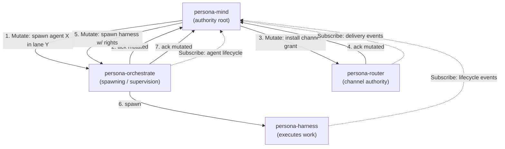

# Skill — component triad (daemon + CLI + signal-* contract)

*The universal shape for every stateful capability in the workspace.
Five invariants and one argument rule determine whether a design is
in this system at all. Read this once; recognise the shape in every
component's `ARCHITECTURE.md`.*

## The shape

Every stateful capability is a triad of three repositories:

```
<component>/                      runtime
  src/lib.rs                      component library
  src/bin/<name>-daemon.rs        long-lived daemon
  src/bin/<name>.rs               thin CLI client
  bootstrap-policy.nota           first-start policy declaration
signal-<component>/               ordinary wire vocabulary
  src/lib.rs                      signal_channel! { … } declaration
  tests/round_trip.rs             rkyv + NOTA round-trips
owner-signal-<component>/         owner-only authority/configuration vocabulary
  src/lib.rs                      signal_channel! { … } declaration
  tests/round_trip.rs             rkyv + NOTA round-trips
```

The contract crates carry no runtime, no actors, no `tokio` — they
declare typed wire vocabulary and nothing else. The runtime crate
owns the daemon, the CLI, and the typed sema-engine state. The
split is filesystem-enforced (per `skills/micro-components.md`).

## The five invariants

Each invariant becomes a witness test (per
`skills/architectural-truth-tests.md`). The test names appear in the
table at the end of this section.

### 1. The CLI has exactly one Signal peer — its own daemon

The CLI is a text bridge into the typed wire for *one* daemon's
contract. It cannot multiplex across daemons, open **any** durable
database, open another component's socket, or speak its own parallel
protocol. "Any database" includes the component's own redb/sema store:
the daemon is the only process that opens durable component state.
The CLI exists because humans and early agents need a text-to-Signal
adapter; once peer daemons speak Signal directly to each other (which
they already do — `persona-introspect`'s daemon queries
`persona-router` over `signal-persona-router`), the CLI is no longer
load-bearing for that path and retires.

The CLI is **eventually obsolete machinery**. Keep CLI-side logic thin
accordingly. A "temporary direct-store CLI" is not a prototype; it is
a triad violation. If the daemon socket is not implemented yet, the
CLI fails closed or remains unshipped rather than opening the store.

### 2. The daemon's external surface is exclusively `signal-core` frames

No `serde_json` socket, no NOTA on the wire between components, no
parallel control protocol. NOTA exists at three named projection edges
— CLI argv/stdin, daemon ↔ harness terminal, audit/debug dumps —
never inter-component.

A daemon may be a Signal client of any number of peer daemons (this is
how daemons compose); the "exactly one peer" constraint applies to
CLIs, not daemons. What no daemon may do is bypass another daemon's
contract — no opening another component's redb, no shared in-memory
state.

### 3. Verbs come in three layers

A component contract speaks three distinct languages, each with
its own concern (settled 2026-05-20T02:00Z per
`reports/designer/246-v4-bundled-fix-deep-design-with-examples.md`):

| Layer | Owns | Examples |
|---|---|---|
| **Contract Operation** (external, on the wire) | the domain action the caller invokes | `Submit(Message)`, `Query(Selection)`, `Configure(Configuration)`, `State(Statement)` |
| **Component Command** (internal, per-daemon) | the daemon's typed executable record | `LedgerCommand::RecordEvent(EventRecord)`, `SpiritCommand::AssertEntry(Entry)` |
| **Sema Operation** (cross-component classification) | the universal payloadless class label for observation/introspection | `Assert`, `Mutate`, `Retract`, `Match`, `Subscribe`, `Validate` |

The contract crate names the Layer-1 operations (per
`skills/naming.md` verb-form rule). The daemon owns its Layer-2
commands. The six Sema classes (Layer 3) live in `signal-sema` as
a **payloadless** enum used by observation only — never
executable, never wire-payload-carrying. Component Commands
project to Sema classes via a `ToSemaOperation` trait so
cross-component observation can filter on classification ("all
Asserts across the workspace") without knowing per-daemon
command payloads.

The six Sema classes and their semantic meanings (the same
table, now framed as classification vocabulary):

| Class | Direction | What kind of state-action |
|---|---|---|
| `Assert` | bottom-up or peer | append a new typed fact / event / row |
| `Mutate` | top-down authority order — *"change this, I don't care what you think"*. Authority issues; subordinate obeys and confirms | replace / transition a record at stable identity |
| `Retract` | top-down authority order | tombstone / remove a typed fact |
| `Match` | any direction | one-shot pattern / range / key query |
| `Subscribe` | observer ↔ producer | initial state + commit-deltas (push, not poll) |
| `Validate` | any direction | dry-run an operation without commit |

**Mutate is the authority verb.** When mind issues a `Mutate` to
orchestrate, mind is *ordering* a change, not asserting a fact. The
recipient obeys and confirms; the issuer transitions its own state
from *possibly-mutated* to *now-mutated* on the confirmation, and only
then proceeds to any downstream order. The Mutate chain maintains
correctness top-down.

**Subscribe flows the other way.** Authority observes state via push-
subscriptions from down-tree (per `skills/push-not-pull.md`), decides,
orders via Mutate down-tree. Observation up, authority down.

**Assert is for new facts.** When a CLI user sends a message, the
component asserts the message exists. When a sensor records an
observation, it asserts. No authority chain — just a new typed fact
entered the system.

### 4. Two authority tiers — both part of the triad

A stateful component has two typed authority surfaces, both part of
the triad:

- **`signal-<component>`** — ordinary peer surface. Variants here are
  callable by any authenticated peer.
- **`owner-signal-<component>`** — owner-only authority/configuration
  surface. Variants here are callable only by the component's owner
  (the entity above it in the workspace's owner graph — e.g., mind
  owns orchestrate; orchestrate owns router and harness).

Each surface gets its own typed listener actor inside the daemon and
its own permission-separated socket. Per-component Unix users/groups
enforce the owner socket as an OS security boundary; same-UID prototype
is for author-only development.

**Contracts split by who-can-call, not by what-state-they-touch.**
Variants in the owner contract are owner-only; variants in the
ordinary contract are peer-callable. *Both contracts can carry
`Mutate` variants* against any kind of state — what places a variant
in one contract rather than the other is whether the caller needs
owner authority. A peer-callable `Mutate` (peer mutates a record they
own, like releasing their own claim) lives in the ordinary contract;
an owner-only `Mutate` (mind orders orchestrate to spawn an agent)
lives in the owner contract.

The two surfaces ship together. A daemon with only the ordinary
surface is not yet triad-shaped — the next implementation arc for any
component must deliver both. Privileged mutable configuration enters
through the owner-signal actor; there is no separate privileged side
channel and no "static local config first, owner-signal later"
implementation path.

### 5. Policy state and working state — both in one sema-engine DB

Every triad daemon's durable state splits into two typed categories,
both living in the same `<component>.redb` opened through
`sema-engine`:

**Policy state** — the rules the daemon enforces.
- Source of truth: the daemon's sema tables, after bootstrap.
- How it changes: only owner-signal `Mutate` verbs (variants in the
  owner contract).
- First-start population: from `bootstrap-policy.nota` in the
  component's repo. The daemon reads this file exactly once — on first
  start, when the policy tables are empty — writes the declared
  records as if they had been Mutated, then records bootstrap-complete
  in a one-shot table. Never reads the file again.
- After first start: changes to `bootstrap-policy.nota` are ignored.
  Policy changes only via owner `Mutate`. Factory reset is deliberate
  — blow away the redb (the daemon re-bootstraps), or issue an explicit
  reset verb.
- Examples (orchestrate): `lane_registry`, `scheduling_policy`,
  `supervision_policies`.

**Working state** — the records produced by operation.
- Source of truth: the daemon's sema tables, from operation.
- How it changes: per the variants in either contract — some peer
  `Assert`s (e.g. activity submission), some peer `Mutate`s of records
  the peer owns (e.g. releasing their own claim), some owner `Mutate`s
  (e.g. mind ordering a run stopped).
- First-start population: empty. Working state never bootstraps from
  file.
- Examples (orchestrate): `claims`, `activities`, `agent_runs`,
  `spawn_plans`, `scope_acquisitions`, `escalation_state`.

The split is by table category — table name prefixes or a sema
table-set declaration — not by storage backend. One sema-engine DB
per component; two categories of table within.

This invariant settles a recurring design question: *"how does the
daemon get its config on first start?"* The answer is bootstrap-once
from a declared NOTA file in the repo; thereafter, owner Mutate is
the only path. The bootstrap file is a one-shot seed, not source-of-
truth.

### Witness tests

| Test | Proves invariant |
|---|---|
| `<component>-cli-accepts-one-argument-and-prints-one-nota-reply` | 1 |
| `<component>-cli-has-exactly-one-signal-peer` | 1 |
| `<component>-cli-cannot-open-any-database-or-peer-socket` | 1 |
| `<component>-daemon-rejects-non-signal-traffic-on-its-socket` | 2 |
| `<component>-signal-verb-mapping-covers-every-request-variant` | 3 |
| `<component>-owner-socket-rejects-ordinary-frame` | 4 |
| `<component>-ordinary-socket-rejects-owner-frame` | 4 |
| `<component>-owner-socket-mode-matches-spawn-envelope` | 4 |
| `<component>-policy-tables-empty-on-first-start-trigger-bootstrap` | 5 |
| `<component>-bootstrap-runs-exactly-once` | 5 |
| `<component>-policy-changes-after-bootstrap-only-via-owner-signal` | 5 |
| `<component>-working-tables-never-read-bootstrap-file` | 5 |
| `<component>-binary-rejects-flag-style-arguments` | argument rule below |

## The single argument rule

Every component binary — CLI and daemon both — takes exactly one
argument on argv. That argument is one of:

- A **NOTA string literal**: `persona-orchestrate '(RoleClaim ...)'`
- A path to a **NOTA file**: `persona-orchestrate ./request.nota`
- A path to a **signal-encoded file** (rkyv binary):
  `persona-orchestrate-daemon ./config.signal`

**No flags.** No `--verbose`, no `--format=json`, no `--config=path`,
no positional second arguments. If the binary needs additional
configuration, that configuration is a field of the NOTA payload —
the contract's NOTA schema is the only source of truth for what
arguments mean.

For the CLI: the argument is a NOTA request record matching one of
the request variants in the component's ordinary or owner contract.

For the daemon: the argument is a NOTA config record naming the
daemon's identity, socket paths, redb path, and the path to its
`bootstrap-policy.nota`. The config record's schema lives in
`signal-<component>` (or a small `<component>-config` crate if it
needs to be shared between daemon and a deploy helper).

If a new argument shape is needed, the contract's NOTA schema gets a
new field or variant — not a new CLI flag. This is the rule that
keeps NOTA the single language for invoking the workspace: the
moment one binary starts accepting flags, the workspace fragments
into ad-hoc CLIs.

## Named carve-outs

These look like triad violations but aren't. Each is *narrow*; do not
extend the pattern of carve-outs.

1. **Pure libraries don't need a daemon.** `signal-core`, `sema`,
   `sema-engine`, `horizon-rs` (projection library) own no state and
   cross no process; the triad does not apply. A test CLI like
   `horizon-cli` for ad-hoc projection is convenience, not a triad.

2. **Data-plane bytes that cannot afford Signal framing.** When a
   component has a high-bandwidth byte path (raw PTY bytes, video,
   audio), the data plane is a separate socket outside the triad. The
   control plane still follows the triad. Canonical example:
   `persona-terminal`'s `control.sock` (Signal) vs `data.sock` (raw
   viewer bytes); raw bytes flow viewer ↔ `terminal-cell`'s
   `data.sock` directly. Document the exception in the component's
   ARCH.

3. **A daemon may be a Signal client of any number of peer daemons.**
   `persona-introspect`'s daemon opens client connections to
   `persona-router`, `persona-terminal`, `persona-manager` over their
   contracts. This is the right shape. The CLI's "exactly one peer"
   constraint does not extend to daemons — fanning out across peers
   is how daemons compose.

## Authority chain — worked example

Persona's correctness is maintained top-down via Mutate chains.
When mind decides a new agent run needs a channel grant so it can
talk to the router:



At each Mutate step the issuer holds *possibly-mutated* state until
the ack arrives; only then does it advance to the next order. Replies
are not opinions — they are confirmations. The authority chain makes
the next step safe: the harness is not spawned with channel rights
until the router has confirmed the channel exists.

## When this skill applies

- **Designing a new stateful component.** Default to the triad. If
  the shape doesn't fit, name which carve-out justifies the
  divergence — or escalate to the user before deviating.
- **Auditing an existing component.** Check it against the five
  invariants and the single-argument rule. Surface deviations in a
  report.
- **Reading a component's `ARCHITECTURE.md`.** The ARCH cites this
  skill and only states component-specific carve-outs — never restates
  the universal invariants.

## See also

- `~/primary/ESSENCE.md` §"Micro-components" — the one-capability-
  one-crate-one-repo rule the triad applies on top of.
- `~/primary/skills/micro-components.md` — filesystem-enforced
  per-capability boundary; the triad is the *shape inside the
  boundary*.
- `~/primary/skills/contract-repo.md` — what lives in a `signal-*`
  contract crate; the verb spine; the boundary table for where NOTA
  renders.
- `~/primary/skills/actor-systems.md` §"Runtime roots are actors" —
  the daemon's actor-root shape.
- `~/primary/skills/push-not-pull.md` — Subscribe, not poll.
- `~/primary/skills/architectural-truth-tests.md` — witness-test
  discipline for the invariants above.
- `/git/github.com/LiGoldragon/signal-core/ARCHITECTURE.md` — the
  wire kernel; closed six-root verb set; `signal_channel!` macro.
