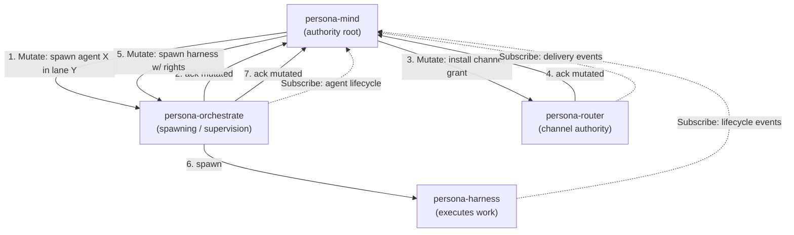

# Skill — component triad (daemon + CLI + signal-* contract)

*The universal shape for every runtime component in the workspace.
Daemon owns state through sema-engine and speaks Signal. CLI is a thin
bridge — one NOTA in, one NOTA out, exactly one peer. Contract crates
own the typed wire vocabulary, per-variant verb mapping, and any
permission-scoped OwnerSignal surfaces. Read this before designing or
auditing any new component.*

---

## The shape

Every runtime component in this workspace is a **triad daemon**:

```
<component>/             repo for the runtime
  src/lib.rs             component library
  src/bin/<name>-daemon  long-lived daemon binary (actor root + storage)
  src/bin/<name>         thin CLI client binary
  src/state.rs           component-owned sema-engine tables/reducers
signal-<component>/      repo for the typed wire vocabulary
  src/lib.rs             signal_channel! { ... } declaration
                         + per-variant SignalVerb mapping
  tests/round_trip.rs    rkyv + NOTA round-trips
<capability>-signal-<component>/   permission-scoped surface such as
                                  owner-signal-<component>
                                  when a distinct security boundary exists
```

Five load-bearing invariants. Each becomes a witness test (per
`skills/architectural-truth-tests.md`):

1. **The CLI has exactly one Signal peer — its own daemon.** No CLI is a
   workspace multiplexer; no CLI directly opens another component's
   database, socket, or in-memory state. The CLI is a text adapter for
   *one* daemon's contract.

2. **The daemon's external surface is exclusively `signal-core` frames.**
   No `serde_json` socket, no NOTA on the wire between components, no
   parallel control protocol. NOTA exists at three named projection
   edges — CLI argv/stdin, daemon ↔ harness terminal, audit/debug dumps
   — never inter-component.

3. **The verb is declared per-variant in the contract crate, not typed
   by the user.** Each `signal_channel!` request enum variant carries
   one of the six `SignalVerb` roots; the CLI's NOTA sugar omits the
   verb because the contract resolves it from the payload type.

4. **The daemon's durable state is a sema-engine database.** The daemon
   owns its component-specific tables, reducers, indexes, and
   subscriptions through sema-engine. It does not open raw `redb`
   tables directly for component state, invent an ad hoc file store, or
   keep durable state only in actor memory. Sema-engine is what lets the
   daemon's state model integrate directly with the `signal-core` verbs:
   `Assert` appends facts, `Mutate` transitions records at stable
   identity, `Retract` tombstones/removes, `Match` queries, `Subscribe`
   streams commit deltas, and `Validate` dry-runs.

5. **Privileged authority is a separate OwnerSignal surface.** When a
   request changes state because an owner is ordering the component
   (`Mutate`/`Retract` authority, lifecycle control, permission grants,
   child process creation, or other privileged component state), the
   request belongs in an `owner-signal-<component>` contract and on a
   distinct owner socket unless a report explicitly marks the ordinary
   placement as prototype debt. The ordinary `signal-<component>`
   surface may still contain ordinary `Mutate` variants; the permission
   boundary is the request vocabulary plus socket, not the verb alone.

The triad is filesystem-enforced (per `skills/micro-components.md`): one
daemon + CLI in `<component>` (typically one Cargo crate with two
`[[bin]]` entries), one ordinary contract in `signal-<component>`, and
one additional permission-scoped contract repo per real security
boundary. Owner surfaces are not an afterthought or module inside the
ordinary contract: they are part of the triad at the component scale
whenever a component has an owner-only command vocabulary.

Additional permission-scoped contract repos are required when the
component exposes a genuinely distinct security boundary (owner-only
authority, read-only observation, public ingress). Do not collapse a
real permission boundary into a module for repo-count convenience. A
privileged contract is a higher-audit surface: editing it changes what
some caller is allowed to say. Owner surfaces use
`owner-signal-<component>` repo names and `owner_signal_<component>`
crate names. Each contract crate carries no runtime, no actors, no
`tokio`.

When a daemon or CLI speaks multiple contract surfaces, it has **one
client/server actor per Signal contract**. Each actor knows exactly one
socket path, from typed configuration with environment variables allowed
as a CLI convenience fallback. The actor sends and receives only that
contract's frame family. The program may have access to multiple
sockets, but it must send the right contract type to the right socket;
there is no generic "send any Signal to any socket" actor.

Pure kernel crates and projection libraries are not runtime components.
`signal-core`, `sema-engine`, `horizon-rs`, and similar libraries may
exist without daemons because they own no long-lived component state and
cross no process boundary themselves. The moment a capability owns
runtime state, accepts requests, supervises actors, or participates in a
Persona engine, it is a triad daemon.

---

## Why this shape

A CLI invocation is a short-lived process. It cannot supervise actors,
own a sema-engine database across requests, hold subscription streams,
or sequence operation identifiers. **A daemon does all four.** The CLI
exists because humans and early agents need a text bridge into the
typed wire; once peer components speak Signal directly (which they
already do — `persona-introspect`'s daemon queries `persona-router`
over `signal-persona-router`), the CLI is no longer load-bearing for
that path.

The CLI is **eventually obsolete machinery**. Keep CLI-side logic thin
accordingly. Per `lojix/ARCHITECTURE.md` §"CLI/daemon boundary": *"Until
agents can speak binary Signal directly, the CLI exists only to
translate human/agent text into daemon Signal and daemon Signal back
into text."*

---

## The six verbs and what each one means

The `SignalVerb` set is closed at six roots (in `signal-core/src/verb.rs`):

| Verb | Direction | What it means |
|---|---|---|
| `Assert` | bottom-up or peer | append a new typed fact / event / row |
| `Mutate` | **top-down authority order** — *"change this, I don't care what you think"*. Authority issues; subordinate obeys and confirms | replace / transition a record at stable identity |
| `Retract` | top-down authority order | tombstone / remove a typed fact |
| `Match` | any direction | one-shot pattern / range / key query |
| `Subscribe` | observer ↔ producer | initial state + commit-deltas (push, not poll) |
| `Validate` | any direction | dry-run an operation without commit |

**Mutate is the authority verb.** When persona-mind issues a `Mutate` to
`persona-orchestrate`, mind is *ordering* a change, not asserting a
fact. The recipient obeys and confirms; the issuer transitions its own
state from *possibly-mutated* to *now-mutated* on the confirmation, and
only then proceeds to any downstream order (spawn the harness, install
the channel, deliver the message). The Mutate chain is how the system
maintains correctness *from the top down*. Without the explicit
authority-verb framing, the same chain devolves into ambiguous
"requests" with no protocol for who has the right to refuse.

**Subscribe flows the other way.** Authority *observes* state via
push-subscriptions from down-tree (per `skills/push-not-pull.md`),
*decides*, and *orders* via Mutate down-tree. Observation up, authority
down.

**Assert is for new facts.** When a CLI user sends a message, the
component asserts the message exists. When a sensor records an
observation, it asserts the observation. No authority chain — just *a
new typed fact entered the system*.

The contract crate (`signal-<component>`) declares the verb per request
variant inside the `signal_channel!` macro. The CLI's NOTA-sugar
omits the verb keyword because every variant maps to exactly one verb.
Concrete: `message '(Send recipient "hi")'` desugars to
`(Assert (MessageSubmission (MessageRecipient recipient) (MessageBody "hi")))`
because `signal-persona-message` declares `MessageSubmission → Assert`.

---

## Named carve-outs

These look like triad violations but aren't. Each is *narrow*; do not
extend the pattern of carve-outs.

1. **Pure libraries are not components.** `signal-core`,
   `sema-engine`, `horizon-rs` (projection library), and similar kernel
   crates own no long-lived runtime state and cross no process. The
   triad applies when a capability becomes a runtime component. A test
   CLI like `horizon-cli` for ad-hoc projection is convenience, not a
   component CLI.

2. **Data-plane bytes that cannot afford Signal framing.** When a
   component has a high-bandwidth byte path (raw PTY bytes, video,
   audio), the data plane is a separate socket outside the triad. The
   control plane still follows the triad. Canonical example:
   `persona-terminal`'s `control.sock` (Signal) vs `data.sock` (raw
   viewer bytes); raw bytes flow viewer ↔ `terminal-cell` `data.sock`
   directly. Document the exception in the component's ARCH.

3. **A daemon may be a Signal client of any number of peer daemons.**
   `persona-introspect`'s daemon opens client connections to
   `persona-router`, `persona-terminal`, `persona-manager` over their
   contracts. This is the right shape. **The CLI's "exactly one peer"
   constraint does not extend to daemons** — fanning out across peers is
   how daemons compose. What the daemon may not do is bypass another
   daemon's contract (no opening another component's redb, no shared
   in-memory state).

---

## The witness tests every triad ships

Each constraint becomes a test (per `skills/architectural-truth-tests.md`).
Use these exact names so the discipline reads at a glance:

| Test | Proves |
|---|---|
| `<component>-cli-accepts-one-nota-record-and-prints-one-nota-reply` | The CLI is one-NOTA-in-one-NOTA-out. |
| `<component>-cli-has-exactly-one-signal-peer` | The CLI cannot multiplex across daemons. |
| `<component>-daemon-rejects-non-signal-traffic-on-its-socket` | The daemon's external surface is exclusively `signal-core` frames. |
| `<component>-signal-verb-mapping-covers-every-request-variant` | Every request variant has a declared `SignalVerb`. |
| `<component>-cli-cannot-open-peer-database-or-socket` | The CLI never bypasses its daemon. |
| `<component>-daemon-state-goes-through-sema-engine` | Durable component state uses sema-engine tables/reducers rather than raw `redb`, ad hoc files, or actor-memory-only persistence. |
| `<component>-one-actor-per-signal-contract-surface` | Each socket surface is bound to its own typed client/server actor; no generic multi-contract socket actor exists. |
| `<component>-owner-signal-surface-is-separate-contract-and-socket` | Owner-only requests live in `owner-signal-<component>` and are served on an owner socket, not hidden in the ordinary contract. |

---

## Authority chain — worked example

Persona's correctness is maintained top-down via Mutate chains.
Concrete: when persona-mind decides a new agent needs a channel grant
so it can talk to the router:



At each Mutate step the issuer holds *possibly-mutated* state until the
ack arrives; only then does it advance to the next order. Replies are
not opinions — they are confirmations. The authority chain is what
makes the next step safe: the harness is not spawned with channel
rights until the router has confirmed the channel exists.

---

## When this skill applies

- **Designing a new stateful component.** Default to the triad. If the
  shape doesn't fit, write down which named carve-out justifies the
  divergence — or escalate to the user before deviating.
- **Auditing an existing component.** Check it against the three
  invariants and the witness tests. Surface deviations in a report.
- **Reading a component's `ARCHITECTURE.md`.** The ARCH should *cite*
  this skill and only state component-specific carve-outs — not
  restate the universal invariants.

---

## See also

- `~/primary/ESSENCE.md` §"Micro-components" — the one-capability-one-
  crate-one-repo rule the triad applies on top of.
- `~/primary/skills/micro-components.md` — file-system-enforced
  per-capability boundary; the triad is the *shape inside the
  boundary*.
- `~/primary/skills/contract-repo.md` — what lives in a `signal-*`
  contract crate; the verb spine; the boundary table for where NOTA
  renders.
- `~/primary/skills/rust/storage-and-wire.md` — rkyv storage/wire
  discipline used by sema-engine-backed component state.
- `~/primary/skills/actor-systems.md` §"Runtime roots are actors" —
  the daemon's actor-root shape.
- `~/primary/skills/push-not-pull.md` — Subscribe, not poll.
- `~/primary/skills/architectural-truth-tests.md` — witness-test
  discipline for the constraints above.
- `/git/github.com/LiGoldragon/signal-core/ARCHITECTURE.md` — the wire
  kernel; closed six-root verb set; `signal_channel!` macro.
