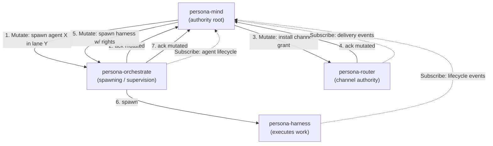
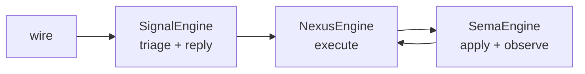

# Skill — component triad (daemon + working signal + meta policy signal)

*The universal shape for every stateful capability in the workspace.
Five invariants and one argument rule determine whether a design is
in this system at all. Read this once; recognise the shape in every
component's `ARCHITECTURE.md`.*

## Two triads — distinguish them

The workspace uses "triad" in two senses; both apply at different layers.

| Triad | Scope | Members |
|---|---|---|
| **Repo triad** (this skill) | Packaging — how a component is laid out across repositories | `<component>` + `signal-<component>` + `meta-signal-<component>` |
| **Runtime triad** | Logic — what happens INSIDE the daemon (three schema-driven planes) | **Signal** + **Nexus** + **SEMA** |

The runtime triad lives INSIDE the `<component>` daemon repo. This skill
covers the repo triad below; the runtime triad gets its own section at
the bottom of this file. Per psyche record 856; refined by record 964
(Executor renamed to Nexus; all three planes are schema-driven).

### "Signal" names two different schema files — keep them distinct

The word *Signal* appears in both triads, and it refers to two distinct
schema artifacts emitted to two different `RustEmissionTarget`s. Conflating
them hides where `SignalEngine` comes from.

| "Signal schema" | Where it lives | Emission target | Emits |
|---|---|---|---|
| **Public signal contract** | `signal-<component>/schema/…` (separate repo) | `WireContract` | Wire vocabulary + codecs ONLY — zero engines. What peers link against. |
| **Daemon-local signal runtime** | `<component>/schema/signal.schema` (inside the daemon crate, beside `nexus.schema` + `sema.schema`) | `SignalRuntime` | The same wire shape PLUS the `SignalEngine` trait (admission / triage / reply) the daemon implements. |

Same word, different files, different targets, different jobs. A daemon's
`SignalEngine` is generated from its OWN `signal.schema` (`SignalRuntime`),
**never** from the public contract (`WireContract`, engine-free). The full
target set is `WireContract`, `ComponentRuntime` (legacy all-in-one),
`SignalRuntime`, `NexusRuntime`, `SemaRuntime` — see
`schema-rust-next/src/lib.rs` `RustEmissionTarget` (the source of truth,
`runtime_planes()`: WireContract→none, ComponentRuntime→all,
SignalRuntime→signal-only, NexusRuntime→nexus-only, SemaRuntime→sema-only).
The three daemon-plane targets are what realize the three-plane split: a
daemon emits `signal.schema`→`SignalRuntime`, `nexus.schema`→`NexusRuntime`,
`sema.schema`→`SemaRuntime`, dropping the all-in-one `ComponentRuntime`
entirely. Per the SignalRuntime resolution (operator + designer,
2026-06-04; designer report 515 — the prior report 514 saw only the
narrower A/B options precisely because it collapsed these two meanings).

Runtime readability test: schema names the interface, generated Rust names the
objects and traits, and handwritten code mostly matches typed input, makes the
decision, calls the next typed interface, and returns typed output. If a daemon
needs large handwritten plumbing to understand its own contract, the mechanism
belongs in schema emission or shared runtime instead.

## The shape

Every stateful capability is a triad of three repositories:

```
<component>/                      runtime
  src/lib.rs                      component library
  src/bin/<name>-daemon.rs        long-lived daemon
  src/bin/<name>.rs               thin CLI client
  schema/signal.schema            daemon-local signal runtime (SignalRuntime → emits SignalEngine)
  schema/nexus.schema             nexus runtime (NexusRuntime → emits NexusEngine)
  schema/sema.schema              sema runtime (SemaRuntime → emits SemaEngine)
  bootstrap-policy.nota           first-start policy declaration
signal-<component>/               ordinary wire vocabulary (WireContract → zero engines)
  schema/lib.schema               schema-derived ordinary signal
  src/schema/*.rs                 generated signal types
  tests/round_trip.rs             rkyv + NOTA round-trips
meta-signal-<component>/          meta policy authority/configuration vocabulary (WireContract → zero engines)
  schema/lib.schema               schema-derived meta signal
  src/schema/*.rs                 generated meta signal types
  tests/round_trip.rs             rkyv + NOTA round-trips
```

The contract crates carry no runtime, no actors, no `tokio` — they
declare typed wire vocabulary and generated method surfaces, and
nothing else. The runtime crate
owns the daemon, the CLI, and the typed sema-engine state. The
split is filesystem-enforced (per `skills/micro-components.md`).
The CLI is bundled runtime machinery: the daemon's thin first client,
not one of the triad's three legs.

## Why the contract is a separate repo — rebuild isolation and authority clarity

The three-repo split (`<component>` + `signal-<component>` +
`meta-signal-<component>`) is not bureaucracy. It buys three concrete
properties. Per psyche 2026-06-04 (record 2605):

1. **Rebuild-churn isolation.** Peers that only need to *talk to* a
   component depend on the small `signal-<component>` contract repo —
   so they recompile only when the **wire contract** changes, not when
   the component's internal logic, runtime, or documentation changes.
   If the contract lived inside the daemon repo, every internal edit
   would change that repo and force every dependent to rebuild. The
   contract is small and stable; the daemon is large and churning.
   Separating them couples a peer's build to the contract's pace, not
   the daemon's.

2. **Security-sensitivity visibility.** Owner-only operations live in a
   distinct `meta-signal-<component>` repo, so a security-sensitive
   edit is obvious from *which repo it lands in* — and clients that do
   not need owner authority do not depend on it at all. The authority
   boundary is a repo boundary, not just an enum-variant boundary. The
   *mechanism* of the split (who-can-call, owner socket vs ordinary
   socket) is §"Two authority tiers" below; this is the *why*.

3. **`meta-signal` is optional.** Some components have no owner
   relationship — they only need the ordinary `signal-<component>`
   contract to talk to peers. Those ship two repos (daemon + working
   signal), not three. The meta-signal repo appears only when the
   component has an owner that issues policy.

The split is about **compilation/dependency isolation and authority
clarity — not about where state or logic lives.** State and logic
always live in the daemon; the contract repos carry only typed wire
vocabulary (per record 2593: wire types + codec, no engine traits —
and per record 2604 the daemon's own Nexus and Sema plane-schemas live
as files inside the daemon crate, never as separate per-plane crates or
repos).

## Component binary naming

A component has two binaries: a CLI half and a daemon half. The
component name (`persona`, `spirit`, `harness`, `orchestrator`,
`chroma`, `chronos`) names the **role** of the whole — it is not
itself the name of any single binary. The binaries are:

- **CLI binary** — named `<component>`. The thin Signal client.
- **Daemon binary** — named `<component>-daemon`. The long-lived
  process holding the sema-engine state.

So the `persona` component is two binaries — `persona` (CLI) and
`persona-daemon` (daemon). The `spirit` component is `spirit` (CLI)
and `spirit-daemon` (daemon). Same shape for `harness`,
`orchestrator`, `chroma`, `chronos`, and every future component.

The CLI binary takes the unprefixed role-name because that is what
the human or peer agent types most often; the daemon binary takes
the `-daemon` suffix because it names the long-lived process and is
typed only by launch infrastructure. Both halves together comprise
the component (per intent records 215 + 216 + 270).

### Repository name vs binary name

The repository name follows the component name. When the repository
carries a disambiguation prefix because the component sits inside a
larger system (e.g. `persona-spirit` to mark spirit as the
persona-system's spirit, distinct from any other future spirit), the
binaries inside it follow the **repository's** component identity:

- Repository `persona-spirit` ships binaries `spirit` (CLI) and
  `persona-spirit-daemon` (daemon).
- Repository `persona-mind` ships a `mind` CLI; the daemon (when it
  lands) is `persona-mind-daemon`.

The CLI keeps the short role-name because users type it; the daemon
keeps the full repo-prefixed name because two persona-system
daemons running side by side need disambiguation in process listings,
socket paths, and systemd units.

### Persona harness wrapping — the `persona-<agent>` family

`persona-codex`, `persona-pi`, `persona-claude` are persona-wrapping
harnesses. The `persona-` prefix marks them as components that wrap
an external agent runtime (Codex, the Pi runtime, Claude Code) into
the persona system. The unprefixed `persona` is reserved for the
engine-manager component (per intent 215). So:

- `persona` (repo + CLI + daemon) — the engine-manager. CLI binary
  `persona`, daemon binary `persona-daemon`.
- `persona-pi` (repo + CLI + daemon) — the Pi-runtime-wrapping
  harness. CLI binary `pi`, daemon binary `persona-pi-daemon`.
- `persona-codex`, `persona-claude` — same shape: CLI `<agent>`,
  daemon `persona-<agent>-daemon`.

### Binary naming table

| Component | Repo | CLI binary | Daemon binary |
|---|---|---|---|
| persona | `persona` | `persona` | `persona-daemon` |
| persona-spirit | `persona-spirit` | `spirit` | `persona-spirit-daemon` |
| persona-mind | `persona-mind` | `mind` | `persona-mind-daemon` |
| persona-router | `persona-router` | `router` | `persona-router-daemon` |
| persona-orchestrate | `persona-orchestrate` | `orchestrate` | `persona-orchestrate-daemon` |
| persona-harness | `persona-harness` | `harness` | `persona-harness-daemon` |
| persona-system | `persona-system` | `system` | `persona-system-daemon` |
| persona-message | `persona-message` | `message` | `persona-message-daemon` |
| persona-terminal | `persona-terminal` | `terminal` | `persona-terminal-daemon` |
| persona-pi | `persona-pi` | `pi` | `persona-pi-daemon` |
| orchestrator | `orchestrator` | `orchestrator` | `orchestrator-daemon` |
| chroma | `chroma` | `chroma` | `chroma-daemon` |
| chronos | `chronos` | `chronos` | `chronos-daemon` |

A standalone top-level component (no parent system) reuses the
component-name for both the repo and the CLI binary; the daemon
binary appends `-daemon`. A child component inside a parent system
(the persona-system family above) carries the parent prefix in the
repo and daemon names; the CLI keeps the short role-name.

### What this is NOT

- The role-name on its own (`persona`, `spirit`, `harness`) is not a
  binary unless that binary is the CLI. There is no binary called
  `persona` that is the daemon; the daemon is `persona-daemon`.
- A `<component>-cli` suffix is not used (the unprefixed name IS the
  CLI). `lojix-cli` is a transitional carry-over name, not the
  convention.
- A `<component>-server` or `<component>-service` suffix is not
  used; the daemon binary always ends in `-daemon`.

## Vocabulary

Use these words consistently:

- **Component triad** — `<component>` runtime repo plus two signal
  contract repos: `signal-<component>` and
  `meta-signal-<component>`.
- **Working signal** / **working contract** —
  `signal-<component>`, the ordinary peer-callable contract.
- **Policy signal** / **meta-signal contract** —
  `meta-signal-<component>`, the meta policy authority and
  configuration contract. Daemon configuration verbs live here:
  after first-start bootstrap, runtime configuration changes are
  meta-signal operations, not CLI flags, ad hoc files, or ordinary
  signal requests.
- **Signal types** — the schema-generated data types declared in
  either signal contract: operation roots, payload records, replies,
  rejection reasons, filters, mail events, stream tokens, and related
  newtypes.
- **Signal tree** — the whole typed schema shape: which relation
  families exist, what the root enums are, how payloads nest, which
  replies and events correspond, and whether the names reveal the
  right logic separation.
- **Policy state** — daemon-owned durable rules/configuration,
  bootstrapped once from `bootstrap-policy.nota` and then changed
  only through meta-signal authority.
- **Working state** — daemon-owned durable operational records
  produced by ordinary operation, with meta-signal mutations only
  where owner authority is required.

Names in signal types are architecture. If a contract name feels
wrong, audit the signal tree before writing more consumers; the name
may be exposing a misplaced relation, an over-broad root enum, or a
policy/working boundary error.

## The five invariants

Each invariant becomes a witness test (per
`skills/architectural-truth-tests.md`). The test names appear in the
table at the end of this section.

### 1. The CLI has exactly one Signal peer — its own daemon

The CLI is a text bridge into the typed wire for *one* daemon's
contract. It cannot multiplex across daemons, open **any** durable
database, open another component's socket, or speak its own parallel
protocol. "Any database" includes the component's own redb/sema store:
the daemon is the only process that opens durable component state.
The CLI exists because humans and early agents need a text-to-Signal
adapter; once peer daemons speak Signal directly to each other (which
they already do — `persona-introspect`'s daemon queries
`persona-router` over `signal-persona-router`), the CLI is no longer
load-bearing for that path and retires.

The CLI is **eventually obsolete machinery**. Keep CLI-side logic thin
accordingly. A "temporary direct-store CLI" is not a prototype; it is
a triad violation. If the daemon socket is not implemented yet, the
CLI fails closed or remains unshipped rather than opening the store.

### 2. The daemon's external surface is exclusively `signal-frame` frames

No `serde_json` socket, no NOTA on the wire between components, no
parallel control protocol. NOTA exists at three named projection edges
— CLI argv/stdin, daemon ↔ harness terminal, audit/debug dumps —
never inter-component.

A daemon may be a Signal client of any number of peer daemons (this is
how daemons compose); the "exactly one peer" constraint applies to
CLIs, not daemons. What no daemon may do is bypass another daemon's
contract — no opening another component's redb, no shared in-memory
state.

### 3. Verbs come in three layers

A component contract speaks three distinct languages, each with
its own concern:

| Layer | Owns | Examples |
|---|---|---|
| **Contract Operation** (external, on the wire) | the domain action the caller invokes | `Submit(Message)`, `Query(Selection)`, `Configure(Configuration)`, `State(Statement)` |
| **Component Command** (internal, per-daemon) | the daemon's typed executable record | `LedgerCommand::RecordEvent(EventRecord)`, `SpiritCommand::AssertEntry(Entry)` |
| **Sema Operation** (cross-component classification) | the universal payloadless class label for observation/introspection | `Assert`, `Mutate`, `Retract`, `Match`, `Subscribe`, `Validate` |

The contract crate's schema names the Layer-1 operations (per
`skills/naming.md` verb-form rule). The daemon owns its Layer-2
commands, but those commands are also schema-authored objects, not
hand-written parallel enums hidden inside daemon code. The six Sema
classes (Layer 3) live in `signal-sema` as
a **payloadless** enum used by observation only — never
executable, never wire-payload-carrying. Component Commands
project to Sema classes via a `ToSemaOperation` trait so
cross-component observation can filter on classification ("all
Asserts across the workspace") without knowing per-daemon
command payloads.

The six Sema classes and their semantic meanings (the same
table, now framed as classification vocabulary):

| Class | Direction | What kind of state-action |
|---|---|---|
| `Assert` | bottom-up or peer | append a new typed fact / event / row |
| `Mutate` | top-down authority order — *"change this, I don't care what you think"*. Authority issues; subordinate obeys and confirms | replace / transition a record at stable identity |
| `Retract` | top-down authority order | tombstone / remove a typed fact |
| `Match` | any direction | one-shot pattern / range / key query |
| `Subscribe` | observer ↔ producer | initial state + commit-deltas (push, not poll) |
| `Validate` | any direction | dry-run an operation without commit |

**Mutate is the authority verb.** When mind issues a `Mutate` to
orchestrate, mind is *ordering* a change, not asserting a fact. The
recipient obeys and confirms; the issuer transitions its own state
from *possibly-mutated* to *now-mutated* on the confirmation, and only
then proceeds to any downstream order. The Mutate chain maintains
correctness top-down.

**Subscribe flows the other way.** Authority observes state via push-
subscriptions from down-tree (per `skills/push-not-pull.md`), decides,
orders via Mutate down-tree. Observation up, authority down.

**Assert is for new facts.** When a CLI user sends a message, the
component asserts the message exists. When a sensor records an
observation, it asserts. No authority chain — just a new typed fact
entered the system.

### 4. Two authority tiers — both part of the triad

A stateful component has two typed authority surfaces, both part of
the triad:

- **`signal-<component>`** — ordinary peer surface. Variants here are
  callable by any authenticated peer.
- **`meta-signal-<component>`** — meta policy authority/configuration
  surface. Variants here are callable only by the component's owner
  (the entity above it in the workspace's owner graph — e.g., mind
  owns orchestrate; orchestrate owns router and harness).

Each surface gets its own typed listener actor inside the daemon and
its own permission-separated socket. Per-component Unix users/groups
enforce the owner socket as an OS security boundary; same-UID prototype
is for author-only development.

**Contracts split by who-can-call, not by what-state-they-touch.**
Variants in the meta-signal contract are owner-only; variants in the
ordinary contract are peer-callable. *Both contracts can carry
`Mutate` variants* against any kind of state — what places a variant
in one contract rather than the other is whether the caller needs
owner authority. A peer-callable `Mutate` (peer mutates a record they
own, like releasing their own claim) lives in the ordinary contract;
an owner-only `Mutate` (mind orders orchestrate to spawn an agent)
lives in the meta-signal contract.

The two surfaces ship together. A daemon with only the ordinary
surface is not yet triad-shaped — the next implementation arc for any
component must deliver both. Privileged mutable configuration enters
through the meta-signal actor; there is no separate privileged side
channel and no "static local config first, meta-signal later"
implementation path.

**`meta-signal` is the canonical policy-contract prefix.** The
workspace-wide rename from `owner-signal-*` to `meta-signal-*` is
active and ratified; new repos, ARCH files, skills, code, and schema
identities use `meta-signal-<component>`. Legacy `owner-signal-*`
and `core-signal-*` names are migration leftovers to retire through
coordinated rename slices, not names to copy into new work.

### 5. Policy state and working state — both in one sema-engine DB

Every triad daemon's durable state splits into two typed categories,
both living in the same `<component>.redb` opened through
`sema-engine`:

**Policy state** — the rules the daemon enforces.
- Source of truth: the daemon's sema tables, after bootstrap.
- How it changes: only meta-signal `Mutate` verbs.
- First-start population: from `bootstrap-policy.nota` in the
  component's repo. The daemon reads this file exactly once — on first
  start, when the policy tables are empty — writes the declared
  records as if they had been Mutated, then records bootstrap-complete
  in a one-shot table. Never reads the file again.
- After first start: changes to `bootstrap-policy.nota` are ignored.
  Policy changes only via owner `Mutate`. Factory reset is deliberate
  — blow away the redb (the daemon re-bootstraps), or issue an explicit
  reset verb.
- Examples (orchestrate): `lane_registry`, `scheduling_policy`,
  `supervision_policies`.

**Working state** — the records produced by operation.
- Source of truth: the daemon's sema tables, from operation.
- How it changes: per the variants in either contract — some peer
  `Assert`s (e.g. activity submission), some peer `Mutate`s of records
  the peer owns (e.g. releasing their own claim), some owner `Mutate`s
  (e.g. mind ordering a run stopped).
- First-start population: empty. Working state never bootstraps from
  file.
- Examples (orchestrate): `claims`, `activities`, `agent_runs`,
  `spawn_plans`, `scope_acquisitions`, `escalation_state`.

The split is by table category — table name prefixes or a sema
table-set declaration — not by storage backend. One sema-engine DB
per component; two categories of table within.

This invariant settles a recurring design question: *"how does the
daemon get its config on first start?"* The answer is bootstrap-once
from a declared NOTA file in the repo; thereafter, meta-signal Mutate is
the only path. The bootstrap file is a one-shot seed, not source-of-
truth.

### Witness tests

| Test | Proves invariant |
|---|---|
| `<component>-cli-accepts-one-argument-and-prints-one-nota-reply` | 1 |
| `<component>-cli-has-exactly-one-signal-peer` | 1 |
| `<component>-cli-cannot-open-any-database-or-peer-socket` | 1 |
| `<component>-daemon-rejects-non-signal-traffic-on-its-socket` | 2 |
| `<component>-signal-verb-mapping-covers-every-request-variant` | 3 |
| `<component>-owner-socket-rejects-ordinary-frame` | 4 |
| `<component>-ordinary-socket-rejects-owner-frame` | 4 |
| `<component>-owner-socket-mode-matches-spawn-envelope` | 4 |
| `<component>-policy-tables-empty-on-first-start-trigger-bootstrap` | 5 |
| `<component>-bootstrap-runs-exactly-once` | 5 |
| `<component>-policy-changes-after-bootstrap-only-via-meta-signal` | 5 |
| `<component>-working-tables-never-read-bootstrap-file` | 5 |
| `<component>-binary-rejects-flag-style-arguments` | argument rule below |

## The single argument rule

Every component binary — CLI and daemon both — takes exactly one
argument on argv. That argument is one of:

- An **inline NOTA argument**: `persona-orchestrate "(RoleClaim ...)"`
- A path to a **NOTA file**: `persona-orchestrate ./request.nota`
- A path to a **signal-encoded file** (rkyv binary):
  `persona-orchestrate-daemon ./config.signal`

Inline NOTA in a shell is wrapped in double quotes around the whole
NOTA object. NOTA strings use `[text]` or `[|text|]`, not `"` string
delimiters, so the shell double quotes remain available as the clean
single-argument boundary. Do not teach agents to wrap inline NOTA in
single quotes as the normal form.

**No flags.** No `--verbose`, no `--format=json`, no `--config=path`,
no positional second arguments. If the binary needs additional
configuration, that configuration is a field of the NOTA payload —
the contract's NOTA schema is the only source of truth for what
arguments mean.

For the CLI: the argument is a NOTA request record matching one of
the request variants in the component's ordinary or meta-signal contract.

For the daemon: the argument is a NOTA config record naming the
daemon's identity, socket paths, redb path, and the path to its
`bootstrap-policy.nota`. The config record's schema lives in
`signal-<component>` (or a small `<component>-config` crate if it
needs to be shared between daemon and a deploy helper).

If a new argument shape is needed, the contract's NOTA schema gets a
new field or variant — not a new CLI flag. This is the rule that
keeps NOTA the single language for invoking the workspace: the
moment one binary starts accepting flags, the workspace fragments
into ad-hoc CLIs.

## No NOTA between components — binary protocol is the wire

Per Spirit 1373 (Principle Maximum, 2026-06-01): **there is no NOTA
between live components.** Daemons and components exchange binary
protocol data on the wire; NOTA is the boundary form, not the
inter-component form.

The single-argument rule above (§"The single argument rule") governs
the **process boundary** — what a binary accepts on argv and prints
on stdout. NOTA is the human-facing surface there because humans and
agents type NOTA. Between two running daemons, neither end is human:
both sides decode binary frames directly, and NOTA never enters the
wire path.

The CLI is the translation/debugging surface between the two regimes:

- **Production round-trip.** CLI reads inline NOTA argv, translates
  the request into a binary frame on the daemon socket, decodes the
  daemon's binary reply, renders it back as NOTA on stdout. The
  daemon never sees or emits NOTA on its socket — only signal-frame
  binary.
- **Debugging round-trip.** Per Spirit 1373, the CLI can wrap a
  normal call in a debugging request — for example, naming where
  trace logs should be displayed or stored. That wrapping is itself
  a NOTA field on the CLI request; the daemon receives only the
  binary frame the CLI translated it into.

The canonical worked example today is `spirit-next`: the daemon ↔
CLI wire is rkyv-encoded signal-frame frames, and the optional
`testing-trace` round-trip across the trace socket is the same shape
— `TraceEvent` is an rkyv-encoded record, not a NOTA string. See
`spirit-next/ARCHITECTURE.md` §"Runtime triad" for the wire layout.

The rule scales: any future inter-component channel (sidecar
sockets, peer subscriptions, lifecycle bus) is binary. NOTA at any
inter-component boundary is a triad violation in the same shape as
NOTA on a daemon socket would be (Invariant 2 above forbids it from
the daemon side; this section names the workspace-wide form).

## Trace enablement is explicit per case

Trace is a typed observability interface, not an implicit runtime side
effect. Each component documents which trace case it is building:

- **Lean daemon / lean CLI.** No trace socket is configured and no trace
  events are collected or rendered. This is the ordinary production
  package shape.
- **Trace-enabled daemon.** The daemon may emit binary rkyv trace frames
  over a typed trace socket. It still does not parse or render NOTA, and
  it never prints trace fallback text with `println!` or `eprintln!`.
  Observation happens through the trace/logging mechanism itself.
- **Trace-enabled CLI or text client.** The client uses the generic
  `triad-runtime` trace client helper to collect typed events and then
  either renders those events as generated NOTA at the user boundary or
  hands them to a SEMA-backed trace/introspect store. The component CLI
  stays a thin wrapper around that reusable client behavior.
- **Trace interface itself.** Do not trace the trace interface by
  default. Trace-of-trace is a separate recursion policy and must be
  designed explicitly before it is enabled.

Schema emission owns the closed trace vocabulary and default engine
hooks. `triad-runtime` owns the reusable trace client/listener/log
mechanics. Component code supplies only domain behavior and, where
needed, a typed sink choice. Do not re-open the old alternatives where
each daemon hand-writes trace listener logic or where schema-rust emits
component-local client glue that should be a shared runtime helper.

## Build configuration is itself a NOTA struct

Per Spirit 1348 (Decision Maximum, 2026-06-01): **build configuration
is itself a NOTA struct with fields.** The single-NOTA-argument rule
above governs runtime daemon and CLI argv; the SAME shape governs
how a component's build switches between production and testing
modes — by reading a NOTA-shaped build config, not by collecting ad
hoc Cargo feature flags.

Today's `spirit-next/flake.nix` realises the switch between lean and
trace-enabled packages through Cargo features (`--features
testing-trace` for the `packages.trace*` variants, no features for
the lean `packages.cli` / `packages.daemon`). That shape is the
correct runtime behaviour realised through the wrong substrate — a
flag soup at the Cargo layer rather than a typed NOTA struct.

The destination shape: each component's build emits a typed
build-config NOTA value (a `BuildConfiguration` record in the
component's contract crate, or a small `<component>-build-config`
crate when the build config needs to be shared between
daemon-internal logic and a deploy helper). The flake declares the
value, the build harness reads it, and the same NOTA-as-the-only-
argument-shape discipline applies. Adding a build option means
adding a field to the build-config record, not appending another
Cargo `--features` flag.

The discipline matches the runtime shape: one NOTA-shaped surface
governs invocation; one NOTA-shaped surface governs build. The
single argument rule generalises across every shape boundary the
component crosses.

## Help operations — discovery through NOTA, not through flags

Because the single-argument rule forbids `--help`, every component
carries discovery through the NOTA channel like any other operation.
Per Spirit record 263, **every component supports the two Help
operations** in its ordinary contract:

- **`(Help Main)`** — top-level discovery. Reply lists the
  component's operations with a one-line description of each and
  the canonical NOTA shape for invoking them.
- **`(Help (Verb <name>))`** — verb-level detail. Reply carries
  the typed schema for one named operation: payload fields and
  their types, a worked example invocation, and the reply shape.

Help operations follow the same discipline as every other
operation: positional NOTA records, single-argument, daemon-side
implementation, typed reply. No flags, no special parsing.

The cleanest implementation direction is **auto-injection** via
the `signal_channel!` macro — the macro emits the Help arm into
every contract automatically; every contract picks Help up on the
next rebuild with no per-contract boilerplate.

**Source of help text — refined by Spirit 1493 (2026-06-03,
Principle High).** Help text comes from a **mirror description
namespace** over the schema's global symbol namespace, not from
Rust doc comments. Every fully qualified symbol — type, variant,
field, operation, route — has a slot in the description namespace
that carries its typed `Description` value. When a symbol's slot
is empty, a default is generated from the symbol's schema
declaration (humanized variant name, field-type-derived prose).
Rust doc comments are agent-facing source documentation; help
served to clients comes from the schema's description mirror.
The earlier direction of deriving Help text from Rust doc
comments (Spirit 263, 1396) is superseded as the source while
the auto-injection mechanism stands.

Sub-design and demo: `reports/designer/487-Design-trace-help-config-context-meta-2026-06-03/2-help-namespace-design.md`.

## Named carve-outs

These look like triad violations but aren't. Each is *narrow*; do not
extend the pattern of carve-outs.

1. **Pure libraries don't need a daemon.** `signal-frame`, `signal-sema`, `sema`,
   `sema-engine`, `horizon-rs` (projection library) own no state and
   cross no process; the triad does not apply. A test CLI like
   `horizon-cli` for ad-hoc projection is convenience, not a triad.

2. **Data-plane bytes that cannot afford Signal framing.** When a
   component has a high-bandwidth byte path (raw PTY bytes, video,
   audio), the data plane is a separate socket outside the triad. The
   control plane still follows the triad. Canonical example:
   `persona-terminal`'s `control.sock` (Signal) vs `data.sock` (raw
   viewer bytes); raw bytes flow viewer ↔ `terminal-cell`'s
   `data.sock` directly. Document the exception in the component's
   ARCH.

3. **A daemon may be a Signal client of any number of peer daemons.**
   `persona-introspect`'s daemon opens client connections to
   `persona-router`, `persona-terminal`, `persona-manager` over their
   contracts. This is the right shape. The CLI's "exactly one peer"
   constraint does not extend to daemons — fanning out across peers
   is how daemons compose.

## Compile-time module index for triad-internal dispatch

When a daemon dispatches across a static set of internal modules
(sema-upgrade across per-component migrations; a parser across
per-grammar handlers; a codec across per-version translators),
prefer a **compile-time index** over runtime registration. Each row
is an explicit submodule reference plus a function pointer:

```rust
pub struct MigrationModule {
    supported: SupportedMigration,
    run: fn(&Attempt) -> Result<ModuleResult, RejectionReason>,
}
pub struct MigrationIndex { modules: Vec<MigrationModule> }

impl MigrationIndex {
    pub fn prototype() -> Self {
        Self { modules: vec![
            MigrationModule {
                supported: persona_spirit::version_0_1_0_to_0_1_1::supported(),
                run: persona_spirit::version_0_1_0_to_0_1_1::run,
            },
            // each new module = one row added here
        ]}
    }
}
```

The index reads as the daemon's literal catalogue: adding a module
is a single-file edit; no dynamic loading, no `Box<dyn Trait>`, no
inventory crate, no plugin protocol. Owner-side policy (which
dispatches are enabled or blocked) is the daemon's overlay on top:
the index says "what the binary knows how to do," the meta-signal
vocabulary says "what the binary is permitted to do."

## Authority chain — worked example

Persona's correctness is maintained top-down via Mutate chains.
When mind decides a new agent run needs a channel grant so it can
talk to the router:



At each Mutate step the issuer holds *possibly-mutated* state until
the ack arrives; only then does it advance to the next order. Replies
are not opinions — they are confirmations. The authority chain makes
the next step safe: the harness is not spawned with channel rights
until the router has confirmed the channel exists.

### Partial-failure semantics — commit-first-success-and-record-divergence

When an issuer's Mutate chain crosses multiple downstream
components (e.g. mind issues a Mutate that orchestrate
propagates to router *and* harness for a single logical
operation), the partial-failure rule is:

**The issuer commits on the first success and records the
divergence on failure.** It does not roll back the successful
leg; it does not stall waiting for an all-or-nothing two-phase
commit; it advances on the success and records the failed-leg
state as a divergence row that downstream tooling (introspect,
the recovery agent) can reconcile.

This matches the precedent established for version-handover
between main and next: spirit records 180 + 183 settled that
*"operations main cannot process at all are acceptable; dev does
the op and main records only the divergence"* and *"when next
catastrophically fails, main recovers what it can from the
original message via partial application; preserves caller intent
across version-divergence failures."* The shape generalizes
beyond version-handover to any Mutate chain that fans out: the
issuer commits the legs that succeeded and records what diverged,
trusting the introspect plane and recovery agent to surface and
heal the divergence later.

Rationale: an issuer that rolls back on first downstream failure
must hold inverse-mutate logic for every Mutate it issues, and
must succeed in applying the inverse against a remote daemon
that may itself be unhealthy — turning partial-failure into a
distributed-rollback problem with worse failure modes than the
original. An issuer that runs two-phase commit pays the
synchronization cost on every Mutate, slowing the common-case
all-success path for the rare partial-failure case. The commit-
first-success path keeps the common-case fast and pays the
reconciliation cost only where divergence actually occurred.

The downstream legs are responsible for typed Unimplemented or
typed failure replies per the skeleton-honesty rule (per
`signal-persona/ARCHITECTURE.md` §"Skeleton honesty"). The
issuer's "record divergence on failure" relies on those typed
replies — a silent drop or panic breaks the partial-failure
protocol.

## When this skill applies

- **Designing a new stateful component.** Default to the triad. If
  the shape doesn't fit, name which carve-out justifies the
  divergence — or escalate to the user before deviating.
- **Auditing an existing component.** Check it against the five
  invariants and the single-argument rule. Surface deviations in a
  report.
- **Reading a component's `ARCHITECTURE.md`.** The ARCH cites this
  skill and only states component-specific carve-outs — never restates
  the universal invariants.

## See also

- `~/primary/ESSENCE.md` §"Micro-components" — the one-capability-
  one-crate-one-repo rule the triad applies on top of.
- `~/primary/skills/micro-components.md` — filesystem-enforced
  per-capability boundary; the triad is the *shape inside the
  boundary*.
- `~/primary/skills/contract-repo.md` — what lives in a `signal-*`
  contract crate; the verb spine; the boundary table for where NOTA
  renders.
- `~/primary/skills/actor-systems.md` §"Runtime roots are actors" —
  the daemon's actor-root shape.
- `~/primary/skills/push-not-pull.md` — Subscribe, not poll.
- `~/primary/skills/architectural-truth-tests.md` — witness-test
  discipline for the invariants above.
- `/git/github.com/LiGoldragon/signal-frame/ARCHITECTURE.md` — the
  wire kernel and signal-frame runtime support.
- `/git/github.com/LiGoldragon/signal-sema/ARCHITECTURE.md` — the
  payloadless Sema classification vocabulary.

## Runtime triad — Signal / Nexus / SEMA (three schema-driven planes)

Inside the `<component>` daemon, three layers organise the logic.
Per psyche record 856; refined by record 964 (Maximum, 2026-05-27);
**consolidated by record 970** (Maximum, 2026-05-27) which names
these the **THREE EXECUTION CENTERS** of the daemon. All three
planes are schema-driven and correspond to the workspace's three
schema types — `Signal` / `Nexus` / `Sema`. Each plane has its
own engine with its own traits, but all three engines share the
pattern of *running code based on input message and returning
output message with populated data*.

**This is Pattern B in the workspace's recurring pattern index**
(per `~/primary/INTENT.md` §"Recurring architectural patterns"
+ record 988, Maximum, 2026-05-27). Pattern A — async lives at
the data-type level — is realised inside the Signal and Nexus
planes via the universal mail mechanism + hookable lifecycle
events (records 935, 962, 963, 970). Pattern D — single-writer
authority + REST-shaped wire — is the SEMA / signal-side pairing
(records 949, 951). Both patterns are intrinsic to this section.

At the schema-language level, all three planes share the same root
shape: imports/exports, input, output, and namespace. Import/export
uses single-colon paths that mirror Rust modules (`crate:module:Type`,
not `crate::module::Type`). The planes differ by runtime ownership,
not by notation: Signal owns communication, Nexus owns execution and
in-flight mail, and SEMA owns durable state.

| Execution center | Schema type | What runs there |
|---|---|---|
| **Signal** | `Signal` schemas | Wire and communication: inter-component messaging |
| **Nexus** | `Nexus` schemas | Execution + mail keeper + Signal-to-SEMA translator: IO, external calls, UI, in-flight message processing |
| **SEMA** | `Sema` schemas | Durable state: single-writer database engine |

### Signal (wire and communication)

**Signal** is the reactive external surface — the daemon's edge,
where messages arrive from outside (people, agents, sibling
daemons). Owns: wire-level framing (length + short-header + rkyv per
the schema-derived stack); schema-emitted Operation enum dispatch;
connection lifecycle; short-header triage before full body decode;
mail-event emission such as `MessageSent`. Does NOT decide
acceptability, touch storage, or interpret payload semantically.

This plane's `SignalEngine` trait is generated from the **daemon-local**
`schema/signal.schema` via the `SignalRuntime` target — NOT from the
public `signal-<component>` contract, which is `WireContract` and
engine-free. See §"'Signal' names two different schema files" above; the
daemon implements `SignalEngine` (e.g. `spirit/src/engine.rs` `impl
SignalEngine for SignalActor`), while peers link only the engine-free
contract.

Per record 963: messages on the signal protocol move through a
universal **mail mechanism** with hookable lifecycle events
(including a method-on-message-sent that fires as soon as a message
is sent). Async representation lives at the data-type level — the
message types themselves carry correlation identifiers and lifecycle
state.

Per record 951 (High, 2026-05-27): the wire is **REST-shaped**.
Schema-emitted Operation enums on the Signal plane are typed
resource operations, not RPC method calls. The single-owner
property (SEMA owns the durable state for each resource kind) is
REST's stateless-server-with-canonical-state semantics realized in
the schema-driven stack.

### Nexus (execution — IO, external calls, UI, mail keeper, translator)

**Nexus** (renamed from Executor per record 964) is the
**execution-layer schema type** and the daemon's **mail keeper +
Signal-to-SEMA translator**. Per record 970 (Maximum, 2026-05-27):
Nexus is *"the in-between runtime layer that owns mail tracking
and Signal-to-SEMA translation. When Nexus has the mail, the mail
is in the BEING-PROCESSED state; Nexus IS the runtime
representation that a mail is being processed."*

Basic Nexus actions: **submit query to Nexus** (execution action)
and **get a reply** (state change or SEMA reply) which Nexus then
translates back into the Signal reply for the Signal plane.

Per records 965-969: Nexus covers ANY layer where code runs in
response to typed input and returns typed output — unifying internal
IO, external execution, and user interfaces under one schema-driven
plane. Per record 970 these uses are **specific instances of the
more fundamental in-between translator + mail keeper role**.

Nexus covers:

| Sub-scope | Example |
|---|---|
| Internal-decision execution | Takes each decoded Operation; decides acceptability, routes forward-only vs state-involving operations; composes Reply |
| External calls (IO) | Cloud component starts the Cloudflare CLI to change DNS — the external call is a nexus schema |
| All user interfaces | **Mencie** (the persona's multi-modal UI with mencie-audio, mencie-introspect, etc. as panels) — each UI panel has its own nexus schema describing data flow and return types |

Two paths through Nexus's internal-decision sub-scope:
**state-involving** (Nexus → SEMA → Nexus → Reply) and
**forward-only** (Nexus → Reply, no SEMA touch).

At the Signal/Nexus boundary, a decoded Signal root becomes
`NexusMail<Payload>` with a `MessageIdentifier`. While Nexus holds
that object, the mail is in processing state. When Nexus receives the
SEMA reply or other execution result, it emits `MessageProcessed<Reply>`
and translates that reply back to the Signal output surface, alongside
logging and hookable lifecycle events. **The on_sent hook fires when
Signal hands mail TO Nexus** (per record 970). The **database marker
travels on the SEMA reply that Nexus receives** and Nexus propagates
it in the Signal response.

Per record 965: Nexus is now **PART OF the schema-derived stack as
the execution-layer schema type**, superseding record 880's earlier
scope-restriction that named Nexus as a separate vocabulary track
parallel to the schema stack.

### SEMA (durable single-writer state)

**SEMA** is the single-writer state layer. Things that don't change
on their own — only the SEMA engine writes. Owns: redb (or
equivalent) read/write of generated archive types; daemon-stamped
timestamps; migration on database load (`mod previous` → `mod next`
bridge); derived indices (topic catalog, identifier mint, etc.);
sema-projection traits where schema declares a sema turn.
**Single-writer invariant**: concurrent operations queue through
SEMA's engine; readers can be multiple but writers are one.

Per record 948: internal database logic uses the same schema-defined
message language as component signals; a growing database component
can split into its own daemon without changing the language pattern.

### The flow (record 970's consolidated picture)

```text
Signal IN
  -> Nexus accepts mail (mail enters BEING-PROCESSED state)
     [on_sent hook fires here — Signal hands mail TO Nexus]
  -> Nexus translates to SEMA query
  -> SEMA engine runs and produces state change + SEMA reply
     (SEMA reply carries the database marker)
  -> Nexus receives SEMA reply (mail has reached state + got response)
  -> Nexus translates SEMA reply to Signal response, propagating
     the database marker; logs the "seriously received" event
     (because there has been a response)
Signal OUT
```

Above all three planes: the schema layer provides the typed shapes
(Input, Output, Action, Response, payload types, mail events) via
schema-emitted Rust. The Rust layer provides the methods on those
shapes (per `skills/rust/methods.md` §"Schema-generated objects are
the method surface").

This is an object-flow rule, not only a naming rule. A decoded Signal
object enters Nexus as mail; the Nexus mail object produces or requests
SEMA work; the SEMA reply carries the database marker; Nexus turns that
reply into the outgoing Signal object. Agents should implement those
steps as methods on the generated objects or on data-bearing actors
(`Engine`, `Nexus`, `Store`, `MailLedger`), never as a loose chain of
free functions.

## Runtime triad engine traits — Signal triage / Nexus computation / SEMA durable

Per spirit records 1326 (operator-addressed Constraint High) and 1327
(designer-captured Principle Maximum, 2026-06-01): **every component
runtime in the workspace triad architecture defines its Signal /
Nexus / SEMA interfaces in schema and conducts core logic through
schema-emitted traits whose methods take and return root types of the
concerned interfaces.** The trait surface is uniform across components;
each component's runtime is a composition of three trait
implementations attached to data-bearing nouns.

The three engine traits and their roles (refined by records 1330-1336):

| Trait | Role | Schema-emitted shape |
|---|---|---|
| `SignalEngine` | **Triage only** (Spirit 1330) — admission, dispatch, identity-stamping, validation, wire-frame handling. No heavy logic. | `triage(signal::Signal<Input>) -> nexus::Nexus<Input>` and a reply path `reply(nexus::Nexus<Output>) -> signal::Signal<Output>`. |
| `NexusEngine` | **Heavy logic** (Spirit 1331) — algorithms, decision-making, database queries, bidirectional translation between Signal and SEMA. Most of a component's work happens here. | `execute(&mut self, nexus::Nexus<Input>) -> nexus::Nexus<Output>` — `&mut self` is the single-flight guard. |
| `SemaEngine` | **Durable single-writer with parallel reads** (Spirit 1332). Writes serialize through `&mut self`; reads run concurrent against `&self` snapshots (redb supports MVCC natively). Database upgrades flow through SEMA per Spirit 1308. | Split: `apply(&mut self, sema::Sema<WriteInput>) -> sema::Sema<WriteOutput>` for writes; `observe(&self, sema::Sema<ReadInput>) -> sema::Sema<ReadOutput>` for parallel reads. |

### Interface direction (Spirit 1333)



Five nodes. Signal → Nexus is one-way (Signal hands the typed Input
forward; never the other direction). Nexus → SEMA goes down for state
operations; Nexus → Signal goes up for replies. SEMA never calls back
up directly — it returns to Nexus which decides the reply shape.

### Pipeline shape (Spirit 1335)

Full request shape: Signal triage → Nexus execute → SEMA apply or
observe → Nexus receives the SEMA reply → Nexus translates → Signal
reply → wire. The Signal reply doesn't map 1:1 to the SEMA reply per
Spirit 1334; Nexus translates, filters, augments. The on_sent hook
fires when Signal hands mail to Nexus; the on_processed hook fires
when Nexus produces the output.

### Origin identifier protocol (Spirit 1336)

Rolling identifiers thread through the whole pipeline. Each layer
routes its responses back via the origin id. SEMA can use it to
associate partial multi-op replies. Per Spirit 1329, the origin route
is preserved across all six plane envelope hops (Signal in / Nexus in
/ SEMA in / SEMA out / Nexus out / Signal out).

### What this pattern is — and is not

- It IS the workspace-wide adaptation of the spirit-engine constraint:
  every component's runtime is a composition of these three trait
  impls attached to schema-emitted nouns.
- It IS a substrate for testability: each engine can be witnessed
  independently through trait-implementing recorder objects (see
  `skills/architectural-truth-tests.md` §"Schema-chain witnesses use
  schema objects").
- It is NOT a fixed implementation shape. Each trait method's body is
  hand-written domain logic; the trait surface is what's uniform.
  Trivial pilots have thin Nexus bodies; mature components have heavy
  Nexus bodies; the trait surface stays the same.
- It is NOT a fourth-plane substrate. Three planes only; no
  "validation engine," "queue engine," or "audit engine" trait
  proliferation. Concerns that look like they want a new engine
  usually fit inside Nexus's heavy logic.

### Lifecycle hooks on the engine traits

Per Spirit 1487 (Decision High, 2026-06-03): *"Generated Signal,
Nexus, and SEMA engine traits should carry minimal lifecycle
hooks: on_start and on_stop with typed start and stop failure
results. Full actor mailbox, backpressure, and runtime-control
traits stay deferred; lifecycle hooks are the minimum addressable
surface persona supervision can use."*

Each engine trait carries two lifecycle methods plus typed failure
types:

```rust
pub trait NexusEngine {
    fn on_start(&mut self) -> Result<(), ActorStartFailure> { Ok(()) }
    fn on_stop(&mut self) -> Result<(), ActorStopFailure> { Ok(()) }
    // ... existing execute / execute_inner / trace hooks ...
}
```

Default bodies are `Ok(())` so a component that has no setup or
teardown needs no override. Components that bind sockets, open
databases, register listeners, or otherwise hold start-time
resources override `on_start`; the failure type carries typed
reasons (port bound, database missing, dependency unreachable)
that persona supervision reads to decide retry / escalate / fail
the component start. `on_stop` is the corresponding teardown hook
with `ActorStopFailure` reasons (graceful-stop-timeout,
state-flush-failure, etc.).

Full actor mailbox + backpressure + runtime-control traits stay
deferred per Spirit 1483 (*"Workspace explicitly defers
backpressure handling, runtime control layer, inner Nexus engine,
actor scheduling/prioritization and related deeper-runtime work
… future-deeper-runtime that won't be touched for a while."*).
The two lifecycle hooks are the minimum supervision surface; if
the actor-trait promotion lands later, it composes as a
supertrait extension without breaking the engine-trait substrate.

Persona-system supervision binds the lifecycle hooks: a
`persona-system-daemon` brings components up via `on_start`,
takes them down via `on_stop`, and reads the typed failure
results to decide policy. Supervision is the first concrete
consumer of these hooks; future consumers (graceful-restart
orchestration, blue/green-style cutover) compose on the same
surface.

### Nexus mechanism substrate — NexusWork / NexusAction / Continue / effects

Per Spirit 1486 (Decision Maximum, 2026-06-03; substrate
ratification): *"NexusWork/NexusAction asymmetric pair + 5-variant
action set (ReplyToSignal, CommandSemaWrite, CommandSemaRead,
CommandEffect, Continue); macro-generated runner loop (triad_main!
emitted from schema-rust-next); effects per-component declared in
schema with Stash as first universal candidate; Continue as
in-process immediate recursion; cross-component invocation via
Signal contracts not Nexus-internal access."* This is the
workspace-canonical engine mechanism; the parts that hold best
move forward as intent develops.

The Nexus trait surface in shape:

```rust
pub trait NexusEngine {
    fn execute(&mut self, input: NexusWork) -> NexusAction;
    // plus the trace and lifecycle hooks above
}

pub enum NexusAction {
    ReplyToSignal(Output),                // hand back to Signal for wire egress
    CommandSemaWrite(SemaWriteInput),     // mutate durable state
    CommandSemaRead(SemaReadInput),       // observe durable state
    CommandEffect(Effect),                // per-component declared effect (Stash, …)
    Continue(NexusWork),                  // re-enter Nexus.execute immediately, in-process
}
```

The runner loop (emitted from schema by `triad_main!` per Spirit
1419) reads NexusActions and dispatches:

- `ReplyToSignal` → hand to Signal's reply path → wire egress.
- `CommandSemaWrite` / `CommandSemaRead` → call SEMA's `apply` /
  `observe` → result becomes the next `NexusWork`.
- `CommandEffect` → call the component-declared effect handler →
  result becomes the next `NexusWork`.
- `Continue` → loop back into `Nexus.execute` immediately,
  in-process, on the same call stack.

Component code becomes a one-line `main` because the runner is
schema-emitted; the component supplies only the trait
implementations for its data-bearing nouns. This is the concrete
form of Spirit 1488 (Decision High): *"Schema source carries the
triad engine mechanism as the baseline so schema authors get the
runner shape, trace plumbing, and continuation substrate through
generation; per-component variation should use explicit escape
hatches for real domain differences rather than hand-implemented
daemon preference."*

**Effects are per-component declared in schema.** `Stash` is the
first universal candidate (slim Nexus output via handle per Spirit
1389). Each component declares its effect vocabulary; the runner
dispatches via the schema-emitted effect handler trait.

**Cross-component invocation goes through Signal contracts, not
Nexus-internal access.** A component that needs to call another
component's Nexus does so by emitting a Signal request to that
component's wire endpoint — never by reaching into another
component's Nexus directly. This preserves the typed boundary,
the closed schema vocabulary per component, and the supervision
clean-edge.

**Deferred deeper-runtime work** per Spirit 1483: backpressure,
runtime control layer, inner Nexus engine, actor scheduling and
prioritization stay future-direction. The substrate above is what
lands now; deeper work arrives if/when overload evidence appears
in real production load.

### Instrumentation belongs to the engine-trait contract

Per Spirit 1365 (Correction Maximum, 2026-06-01): **traceability is
expressed as traits on schema-derived interfaces — and where
possible, as methods on the Signal/Nexus/SEMA engine traits
themselves — not as a hand-written or generated event enum living
beside the engines.** Instrumentation belongs to the interface/actor
contract, not to a local side vocabulary parallel to it.

The emitted shape: the engine traits carry default-no-op trace hook
methods (`trace_signal_admitted`, `trace_signal_triaged`,
`trace_signal_replied`, `trace_nexus_entered`, `trace_nexus_decided`,
`trace_sema_write_applied`, `trace_sema_read_observed`, and their
per-plane activation entry points). Implementors who want trace
override the hooks; non-trace consumers inherit the no-op default and
pay nothing. The trace surface is part of the trait, not a parallel
vocabulary the runtime carries alongside.

The canonical emission lives at `schema-rust-next/src/lib.rs`
(roughly lines 1825-1907): the schema emitter writes the trace
methods straight into the engine trait declarations. The
`testing-trace` Cargo feature (the runtime side of Spirit 1348's
build-config discipline above) gates whether overrides ship, but the
trait surface is uniform — feature-off implementors get the no-op
default; feature-on implementors override per-hook.

The earlier shape this corrects is the side-enum pattern: a
hand-written `TraceEvent` enum next to the engines, with a
`record_trace` call studded through the engine bodies. That shape
makes instrumentation a separate dialect of the engine; the
trait-method shape keeps instrumentation a first-class extension of
the engine's contract. Per Spirit 1365 the correction direction is
explicit — anywhere instrumentation tempts a side enum, push the
hooks onto the trait instead.

### Trace identity is schema-emitted, not stringly

Per Spirit 1400 (Decision High, 2026-06-02): **trace names are
macro-emitted from the schema-defined enum variant structure, not
free-floating strings.** The macro knows what is being activated
because it generated the variant; the trace surface reuses the
generated names rather than re-deriving them at the call site as
literals.

Per Spirit 1408 (Clarification High): the typed header object is
primary; compact numeric encodings and wider extended headers are
downstream representations of that typed identity.

The shape that landed (`schema-rust-next` commit `fa3f615` +
`spirit-next` commit `2179f49`): the emitter projects, from each
plane root enum's variants, a `<Plane>ObjectName` enum plus a
wrapping `TraceInterfaceObject` enum. The same emission produces
the `TraceActorObject` enum from per-plane actor variants. The
runtime trace event becomes a typed `TraceObject` (one of the
emitted plane objects), not a `String` newtype or a `&'static str`
literal. Implementors of the engine traits dispatch on the typed
identity rather than parsing a name.

Two trace forms are supported by the macro:

- **COMPACT** — root variant name only (`trace_input_remove`). The
  default for testing-build Layer 2 witnesses where the
  architectural-crossing claim is the substance.
- **EXTENDED** — nested variant chain through enum-typed payloads
  when the payload is itself an enum. The chain stops at the root
  variant when the payload is a struct. The macro has the
  enum-vs-struct information at compile time, so the form is chosen
  statically.

The 2-row interface chain is: row 1 = root variant; row 2 = payload
(struct-leaf, chain stops; or enum-continue, chain continues into
row 3 etc.). The trace name's structural depth measures interface
realism: a deeper chain reflects a richer typed contract. When the
chain bottoms out at a struct in row 2, the component's schema may
be under-developed — compare against §"Interface roots are enums
with more than one variant" below.

The transitional `TraceObjectName(String)` shape that the prototype
in designer 467 introduced retired with the typed-identity
emission. No `String` shadows of the typed identity persist at the
trace surface.

### Interface roots are enums with more than one variant

Per Spirit 1401 (Clarification High, 2026-06-02): **an interface is
an enum at the root with MORE THAN ONE variant.** If a designer
cannot name more than one operation the root represents, the design
is incomplete and not an interface. Single-variant enums prove
themselves newtypes in practice — the variant adds no discrimination
the type system needs.

Input and Output are the two primary interface roots; payloads are
themselves either structs (leaf data) or enums (nested interfaces).
The interface chain depth measures design realism — the row-1 root
plus row-2 payload pattern from the trace identity section above
applies to every interface.

Two consequences for the schema authoring loop:

- When sketching a schema source, ask **"can I name two operations
  on this root?"** If not, the design isn't done yet — keep
  developing until at least two meaningful variants land. Add
  Lookup + Count + Summarize beside Observe; add Subscribe beside
  the request/reply pair; promote the unit variant to its full
  data-bearing form.
- A one-variant root that survives review is a newtype wearing enum
  clothing. Replace it with the struct or scalar it actually is, and
  let the schema's namespace import the type directly.

Worked example: `SemaReadInput [(Observe Query)]` fails the rule —
that's an `Observe(Query)` newtype, not an interface. The expansion
to `SemaReadInput [(Observe Query) (Lookup RecordIdentifier) (Count
Query) (Summarize Query)]` (four variants) makes it a real
interface and gives Nexus a real per-variant decision surface.

Per psyche 2026-06-02 (Spirit 1395 introduced the developed-
interface direction; 1401 formalizes the multi-variant threshold).

### Nexus's inner-world / outer-world vocabulary

Per Spirit 1388 (Clarification, 2026-06-01): **Nexus sits between
two worlds** — the OUTER world (Signal — clients, wire ingress and
egress, the boundary across processes) and the INNER world (SEMA —
durable state mutations and observations). Nexus is the center that
decides; Signal and SEMA are its peripheries.

The vocabulary makes architectural roles explicit. Signal owns the
outer boundary: messages crossing process lines, wire framing,
identity stamping, frame triage. SEMA owns the inner boundary: redb
writes, observation against durable snapshots, the database marker.
Nexus owns the in-between: it receives the typed Input from Signal,
runs the decision logic, requests SEMA work, receives the SEMA
reply, and translates the result back through Signal to the outer
wire.

The shape rhymes with the object-oriented insight of interfaces
first — Nexus is the center holding the interface contract that the
two boundary planes (Signal and SEMA) terminate. Consistent with
the engine-trait architecture above (Spirit 1326-1336) and with the
origin-route threading through the full Signal-Nexus-SEMA pipeline
(Spirit 1336): Nexus is the place the origin route lives long enough
for partial multi-op replies to associate back.

The canonical worked example today is `spirit-next`: NexusEngine and
SemaEngine are schema-emitted; SignalEngine implementation lives in
the runtime substrate. Per `spirit-next/ARCHITECTURE.md` §"Runtime
triad" the full pipeline shape and per-engine borrow rules are
documented in code-adjacent prose. The pattern's broader workspace
adoption is part of the porting waves named in the designer-operator
loop.
