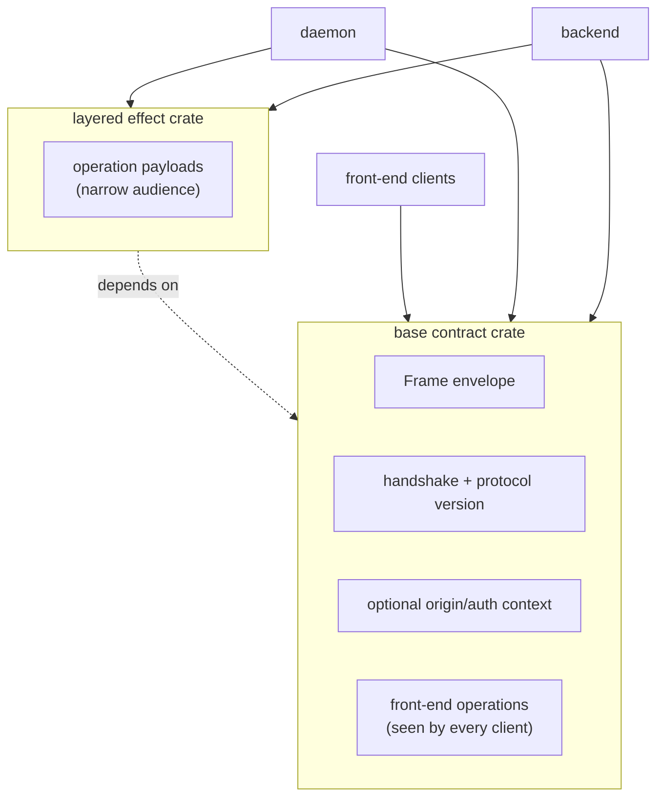
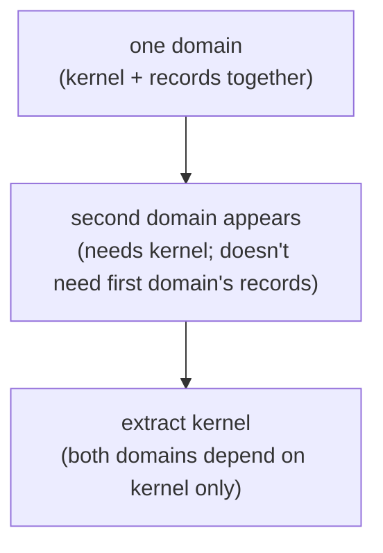
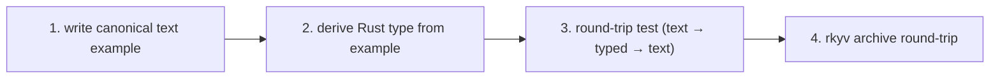
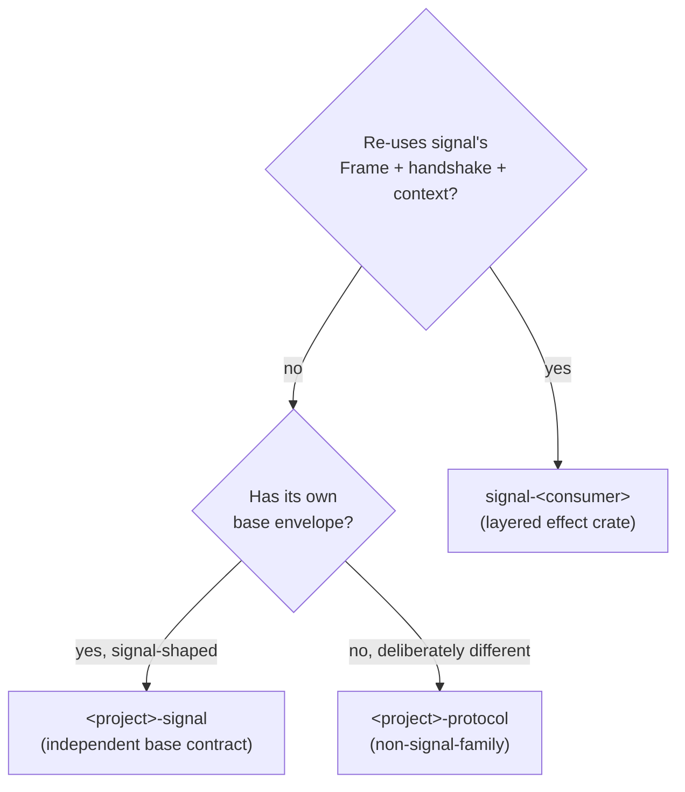

# Skill — contract repos

*The wire contract between Rust components lives in a dedicated
repo of typed records, not duplicated across consumer crates.
Every component on the same fabric depends on the same contract
crate; rkyv archives produced by one are readable by every
other.*

## What this skill is for

When two or more Rust components need to **signal** each other
over a wire — a Unix socket, TCP, message bus, named pipe,
mmap region — the record types they exchange live in a
**contract repo**: one crate, one home, every consumer pulls
it as a dependency. This skill is *when* you reach for that
pattern, *what* belongs in the contract crate, and *how* it
relates to layered protocols and human-facing NOTA projections.

**Signaling** is the workspace verb for inter-component
communication via length-prefixed rkyv archives. A contract
repo is the typed vocabulary of one signaling fabric — the
shared `Frame`, the closed enum of payloads, the handshake,
and any identity/origin/auth context that genuinely crosses
that boundary. Components that signal each other depend on
the same contract repo.

The principle is `~/primary/ESSENCE.md` §"Perfect specificity at
boundaries" applied across processes. The Rust enforcement
sits on top of `~/primary/skills/rust/storage-and-wire.md` —
that skill defines the rules; this one names how the contract
is *organised* in repos.

The canonical workspace example is **signal**
(`~/primary/repos/signal`) — the wire-protocol crate of the
sema-ecosystem, and the namesake of the pattern. Read its
`ARCHITECTURE.md` once before designing a new contract repo;
the shape is concrete there.

## Why a contract repo exists

rkyv archives interoperate **only** when both ends compile
against the same types with the same feature set. Three
consequences make a shared crate the right home:

- **Schema agreement.** A `Frame` defined in one component and
  redefined in another is two types — the bytes don't round-
  trip even if the field lists look identical. The contract
  crate is the single definition.
- **Derive sharing.** Wire-format derives (rkyv's
  `Archive`/`Serialize`/`Deserialize`, `bytecheck`), text-
  format derives (`NotaEnum` / `NotaRecord` / `NotaTransparent`
  from `nota-codec`), and any project-specific derives all
  live with the type. The contract crate owns both the wire
  shape and the text shape on the same types; consumers do
  not carry shadow types that re-derive across layers.
  Re-deriving in each consumer is dead code at best, drift
  at worst.
- **Layered stability.** When a layered effect crate adds
  operation payloads (e.g. signal-forge over signal), front-end
  clients that depend only on the base contract don't recompile
  on layered-crate churn. The isolation is at the *layered*
  effect-crate boundary, not at the wire/text-derive boundary
  on the base contract itself.

A workspace pattern that doesn't follow this:
- types defined in component A, copy-pasted into component B,
- two components own "the same" wire format,
- bytes silently drift on schema changes.

This is exactly the class of bug rkyv's strict layout makes
invisible (no parse error, just wrong values).

## What goes in a contract repo

```
contract-repo/
├── src/
│   ├── lib.rs        — module entry + re-exports
│   ├── frame.rs      — Frame envelope, encode/decode, error type
│   ├── handshake.rs  — ProtocolVersion + handshake exchange
│   ├── origin.rs     — origin/auth context records (only when the boundary carries them; many local-engine contracts omit this entirely)
│   ├── request.rs    — Request enum (closed; per-operation dispatch)
│   ├── reply.rs      — Reply enum (closed; matches request kinds)
│   ├── <operation>.rs — per-operation typed payloads
│   ├── <kind>.rs     — domain record kinds + paired *Query types
│   └── error.rs      — crate Error enum (thiserror)
├── tests/            — round-trip per record kind, per operation
├── Cargo.toml        — pinned rkyv feature set, versioned
└── ARCHITECTURE.md   — what's owned, what's not, schema discipline
```

The contract crate **owns**:

- The `Frame` envelope and its `encode` / `decode` methods.
- Length-prefix framing rule (4-byte big-endian per archive).
- Handshake + protocol version + compatibility rule
  (major-exact / minor-forward, or whatever the project picks).
- Origin/auth context records only when the boundary carries
  identity, provenance, capability, or signature material.
  Do not create a proof type just because the template has a
  slot for one.
- The closed enum of request kinds + paired reply kinds.
- Per-operation typed payloads (closed enums of typed kinds — no
  generic record wrapper, no `Unknown` variant).
- The version-skew guard's known-slot record (schema +
  wire-format version).
- A complete round-trip test per record kind (rkyv frame
  round-trip *and* NOTA text round-trip, both witnessed in
  `tests/`).
- `NotaEnum` / `NotaRecord` / `NotaTransparent` derives on
  the typed records, so contract values are NOTA-encodable
  directly. The same type IS the wire record AND IS the text
  record; consumers consume it once.
- Reserved record heads stay reserved workspace-wide. No
  domain type defines a record kind named `Bind` or
  `Wildcard`; those heads belong to
  `signal_core::PatternField<T>` dispatch.

It **does not own**:

- Daemon code. No actors, no runtime, no `tokio`.
- Component-internal state at the **runtime** level — each
  daemon's redb tables, its reducer state, its supervisor
  tree are private. Reducers, write paths, transaction
  boundaries, and the actual `Database::open` call stay
  inside the daemon.
- Logic that interprets the records. Validation pipelines,
  routing rules, gate decisions stay in the daemons.
- NOTA projection *policy* and *surfaces*. The contract owns
  text codec on its types (per "What it owns" above) — every
  contract value is NOTA-encodable directly. The contract does
  not own *where* NOTA renders (which CLI prints it, which
  daemon endpoint accepts it, which audit format wraps it) or
  the composition of Nexus wrapper records for a particular
  human-facing form. Projection policy lives in the boundary
  component.
- Configuration. `Cargo.toml`, `flake.nix`, deployment.
- `serde`. Contract types may *also* derive serde for debug
  rendering, but the contract is rkyv-on-the-wire.

It **may own**:

- **Typed introspection record shapes for durable
  inspectable state.** A contract crate may declare the typed
  record shape of a redb-stored value so peer components and
  `persona-introspect` can name what's inspectable. The
  contract owns the *vocabulary* of inspectable state; the
  component still owns the database, the reducers, the
  consistency model, and the projection policy (which
  fields are exposed, how snapshots are taken, redaction
  rules). Operational records (those that cross a live
  boundary) stay in their existing operational contract;
  introspection-only records may land in a dedicated
  `signal-persona-<X>-introspect` crate when the
  inspection vocabulary is heavy or high-churn enough to
  separate from the operational surface.

## Contracts name a component's wire surface

A contract repo is the typed-vocabulary bucket for **one
component's wire surface**. Multiple relations within one
component's contract are fine — a harness component speaks
delivery-from-router, identity-query-from-anyone,
transcript-tail-to-subscribers, lifecycle-observation-to-
mind, all in one signal-persona-harness crate. The
component is the unit of contract ownership; relations
within it co-evolve and share the typed records they touch.

What a contract crate is **not** is a workspace-wide grab
bag mixing vocabularies from unrelated components. A crate
that wants to hold both signal-persona-mind records and
signal-persona-router records has stopped being a contract
and started being a shared utilities crate; split it.

Each relation within a contract crate is still named
explicitly — name the relations in `ARCHITECTURE.md` so
readers can find them, and split source modules by
relation when the file count justifies it (e.g.
`src/delivery.rs`, `src/identity.rs`, `src/transcript.rs`).

For each relation a contract carries, name it in plain
English:

1. **Endpoints.** Who can send, who can receive, and who is
   only observing?
2. **Cardinality.** Is the relation one-to-one, many-to-one,
   one-to-many, or many-to-many?
3. **Direction.** Which facts are requests, replies, events,
   observations, subscriptions, assertions, mutations, or
   retractions?
4. **Authority.** Which side mints identity, time, slots,
   revisions, and sender fields? Those must not be agent-
   supplied fields.
5. **Lifecycle vectors.** What can happen at the root of the
   relation: submitted, accepted, rejected, assigned,
   unassigned, closed, expired, cancelled, observed?

Each named relation within a contract crate has its own
closed root enum (or closed request/reply/event family)
naming that relation's vectors. A `Request`, `Reply`, or
`Event` variant is not "whatever payload fits today"; it is
one mutually-exclusive way the relationship can move. A
multi-relation contract crate (one component, multiple
relations) has one root family per relation, not one
crate-wide enum. If the root variants are wrong, every
consumer is forced to program with the wrong model.

Naming is therefore load-bearing architecture:

- Prefer domain nouns for payload records. A `Submit` operation
  can carry a `Message`; a `Configure` operation can carry a
  `Configuration`; a `Register` operation can carry a
  `Registration`.
- Contract operation roots are verbs, in verb form. `Submit`,
  `Query`, `Observe`, `Configure`, `Register`, `Retire`, `Start`,
  and `Stop` name what the caller is doing at this boundary.
  Do not force those public actions under Sema state-effect
  words such as `Assert` or `Match`.
- Do not repeat namespace already supplied by the crate,
  module, channel, relation, owning component, or enclosing
  enum. This is a hard naming rule, not a style preference.
  A `signal-repository-ledger` payload named
  `RepositoryChangedFileQuery` is wrong because the repository
  ledger context is already supplied by the contract; the name
  should be `ChangedFileQuery`. `signal_persona_message::
  MessageRequest::MessageSubmission` may need `Message`
  because the relation is message-shaped; `PersonaMessage`
  repeats the crate/component namespace.
- Do not fix under-specified names by adding generic suffixes.
  `Data`, `Payload`, `Info`, `Operation`, `Generic`, `Mixed`,
  `Ok`, and `ThingRequest` are warning signs unless the
  surrounding relation makes them exact.
- A variant and its payload may share the same domain noun
  when that noun is the exact vector. That is better than
  shortening the variant until it becomes vague. If the
  phrase stutters, split the meaning: root variant names the
  vector; payload type names the record carried by that
  vector.
- Field names inherit context from their containing record.
  Keep fields short when the record supplies the noun, but
  newtype the wire form when the primitive alone is too weak
  (`WirePath`, `TaskToken`, `TimestampNanos`, `QueryLimit`).
- Never encode lifecycle uncertainty as `Unknown` or a string
  kind. Add the missing relation vector as a closed enum
  variant, then coordinate the upgrade.

Run the naming pass in this order:

1. Read the repo's `ARCHITECTURE.md` and write the relation
   sentence.
2. List every top-level enum and decide whether each enum is
   the root vector set, a payload kind set, a lifecycle state,
   an error reason, or an identity reference.
3. Audit root variants first. They set the domain grammar that
   all payload names must fit.
4. Audit payload structs and nested enums second.
5. Audit field names and primitive wrappers third.
6. Read examples and call sites last. If the code reads like
   the wrong relationship, rename the contract before writing
   more consumers.

For a new contract repo or a large rename, make the naming
review an explicit work item. Contract names are harder to
escape than architecture prose: once consumers compile
against them, the names become the system's enforced model.

## Public contracts use contract-local operation verbs

Signal carries typed contract messages across component
boundaries. Sema names the universal state-action classes used
for observation and introspection. Executable database commands
are component-local typed records owned by each daemon.

A contract crate names the public actions that can cross one
component boundary. Those public actions are **contract-local
operation verbs**: they describe what the caller is doing in
that component's domain, not what the receiver may later do to
its state.

> **Current direction, per `intent/component-shape.nota`
> 2026-05-20T02:00Z:** the
> universal roots (`Assert`, `Mutate`, `Retract`, `Match`,
> `Subscribe`, `Validate`) are the **Sema classification
> vocabulary** for observation — they are *payloadless* state-
> action class labels, not executable. Executable database work
> happens via **component-local typed Commands** owned by each
> daemon. Contract operations are domain-named (`Submit`, `Query`,
> `Observe`, `Configure`, etc.); the daemon lowers them into
> typed Commands; Commands project to Sema class labels for
> observation. Sema is the cross-component nervous system at
> the classification layer, not a universal executable database
> DSL.

The three layers:

```text
Contract operations  (external — what crosses the wire)
  public per-contract verbs such as Submit, Query, Observe,
  Configure, Register, Retire, State, Watch.
  Owned by signal-* contract crates.

Component commands  (internal — what the daemon executes)
  per-component typed executable records such as
  SpiritCommand::AssertEntry(Entry),
  LedgerCommand::RecordEvent(EventRecord),
  LedgerCommand::ReadRecentRepositories(ReadPlan).
  Owned by each daemon; carry the typed payloads engines need.

Sema operations  (cross-component classification — what
                  observation/introspection sees)
  payloadless state-action class labels:
  Assert | Mutate | Retract | Match | Subscribe | Validate.
  Used only for cross-component observation and introspection;
  never for execution.
```

Each Component Command projects to a Sema class via a
`ToSemaOperation` trait. The engine layer is a reusable
framework parameterized over the component's Command type —
atomic boundaries, snapshots, redb transaction handling are
common; the Command vocabulary is component-local.

The client sends what it wants to do at that boundary:

```nota
(Submit (Message ...))
(Query (RecentRepositories ...))
(Configure (DaemonConfiguration ...))
(State (Quote ...))
```

The daemon decides whether that public action lowers to no
Sema effects, one effect, many effects, a forwarded request,
or a rejection.

### Operation naming rule

**The operation root is a verb, in verb form.** Use `Submit`,
not `Submission`; `Query`, not `QueryRequest`; `Observe`, not
`Observation`; `Configure`, not `Configuration`; `State`, not
`Statement`.

The payload that follows the operation is usually a noun:

```nota
(Submit (Message ...))
(Register (Registration ...))
(Configure (Configuration ...))
```

Same verb spelling across contracts is allowed. The receiver
context supplies the meaning. `Observe` in a repository ledger
contract and `Observe` in a Spirit contract are not required to
mean the same thing beyond "caller asks this receiver to
observe something in its domain."

### What moved below the public contract

The Sema operation vocabulary is still real, but it is not the
public grammar of every component:

| Sema operation | Layer meaning |
|---|---|
| `Assert` | insert/append a typed fact/event/row |
| `Mutate` | transition a record at stable identity |
| `Retract` | tombstone/remove/retract a typed fact |
| `Match` | pattern/range/key read over typed tables |
| `Subscribe` | state-plus-delta stream over typed tables |
| `Validate` | dry-run validation/planning without commit |

These words belong in the Sema engine layer and in any explicit
Sema-facing contract (signal-sema itself, or a deliberately
Sema-facing socket that IS the public service offered) — never on
an ordinary component's public wire. Per psyche 2026-06-04 (record
2612): **Sema classification vocabulary is forbidden on the public
contract wire.** The six words must not appear as request-root
tags, a contract must not mirror them as an `AuthorizedSignalVerb`
enum, and a contract event must not carry the payloadless
`SemaObservation` label. Contract operation roots are domain verbs;
the Sema class is something the daemon derives internally, never
something a peer sends or names on the wire. The earlier soft
"most component contracts should not" is retired in favour of this
firm prohibition — the six legacy contracts that still carry the
pattern (signal-mind, signal-router, signal-criome,
owner-signal-persona, signal-persona-spirit, signal-orchestrate)
are a cleanup track, not a tolerated convention.

### Lowering is daemon logic

Each daemon is the lowering boundary:

```text
public contract operation
  -> validation / routing / authorization
  -> Sema operation plan when durable state changes or reads are needed
  -> commit / reply / event
```

That lowering belongs in the runtime component, not in the
contract crate. The contract may define typed records that make
lowering inspectable, but it does not own reducers,
authorization, routing, transaction boundaries, or table
execution.

Static lowering examples:

```text
Query RecentRepositories -> Sema Match over repository indexes
Watch Entries            -> Sema Subscribe over entry tables
```

Dynamic lowering examples:

```text
Submit Message
  -> reject without write
  -> assert ingress event
  -> mutate delivery state
  -> forward to router

State Quote
  -> record raw psyche statement
  -> update working view
  -> enqueue mind suggestion
```

### Tests for contract-local verbs

Contract tests assert the public grammar:

- every operation root is a domain verb in verb form;
- no public contract operation wraps payloads in mandatory
  Sema roots unless the contract is explicitly Sema-facing;
- examples round-trip in NOTA and rkyv using the same typed
  records;
- repeated suffixes such as `*Query`, `*Command`, `*Event`,
  and `*Listing` are checked as schema smells before the type
  shape is accepted;
- when a daemon publishes lowering witnesses, those witnesses
  prove the runtime mapping from public operation to Sema plan.

Examples of stale shapes to avoid:

```nota
(Assert (Message ...))
(Match (Query ...))
(Mutate (Configure ...))
```

Better public shapes:

```nota
(Submit (Message ...))
(Query (...))
(Configure (...))
```

### Reply discipline

**Reply success variants are verb-past-tense matching the
operation root.** `Submit` → `Submitted`; `Register` →
`Registered`; `Launch` → `Launched`; `Retire` → `Retired`;
`Query` → `Queried` or `Observed` (the action's outcome,
verb-past-tense).

**Reply rejection variants are verb-past-tense + `Rejected`.**
`Submit` → `SubmitRejected`; `Register` → `RegisterRejected`.
Domain-level rejection reasons are payload variants of the
`*Rejected` reply (typed enum named e.g. `SubmitRejectionReason`).

**When the verb-past-tense collides with a noun derived from the
verb,** fall through to the next-best past-tense that names what
the daemon actually did after receiving the operation.
`Announce` → `Announcement` (noun collision; "Announced" would
be ambiguous with the noun) → use `Identified` (the daemon
identified the announcer; concrete past-tense outcome).

**Lifecycle-shaped verbs (`Start` / `Stop` / `Drain` / pairs of
them) may share a single `Action*` pair** when the daemon's
response shape is uniform across them:
`ActionAccepted(ActionAcceptance)` /
`ActionRejected(ActionRejection)`. This is the signal-persona
precedent — both `Start` and `Stop` use the same pair because
the reply contract doesn't vary by which lifecycle verb fired.

Replies are causally tied to the request operation they answer.
If a "reply" becomes an independent observation or event that
can travel without a request, model it as an event/stream record
in the contract. Do not hide independent event traffic inside a
reply enum just because it was convenient for the first test.

**Event variant naming follows the same verb-past-tense rule.**
A `RecordStream` emitting `RecordCaptured` events reads as
"the record was captured"; a `StateStream` emitting `StateChanged`
reads as "the state changed." Past-tense outcome describing what
happened, not what was requested.

### See also

- `~/primary/reports/designer-assistant/125-v2-contract-local-verbs-vs-sema-core-verbs.md`
  — analysis behind the contract-local-verb / Sema split.
- `/git/github.com/LiGoldragon/signal-core/ARCHITECTURE.md`
  — currently in transition; frame/exchange mechanics should
  survive the split.
- `/git/github.com/LiGoldragon/sema-engine/ARCHITECTURE.md`
  — Sema execution vocabulary and read plans.

## The layered pattern

When a wire protocol has audience-scoped concerns — operation
families that only a subset of components care about — those
operations land in a **layered effect crate**, not in the base
contract:



The pattern (signal-forge over signal is the canonical
example): the layered crate **re-uses** the base contract's
`Frame`, handshake, and any boundary origin/auth context, and
**adds** its own operation payload enum. New layered operations
land in the layered crate; front-end clients that depend only on
the base contract don't recompile.

Use a layered crate when:

- The operations have a narrow audience (sender + receiver +
  maybe one transitional caller, not "every client").
- The base contract would otherwise grow to absorb effect-
  specific concerns that don't belong on the front-end
  surface.
- Recompile cost across the front-end surface is real (signal
  has many front-end clients; recompile churn matters).

Don't pre-layer. A second contract crate's layered shape
becomes obvious after one effect-bearing leg is real and a
second is being added.

## Versioning is the wire

The contract crate's semver **is** the wire's semver:

- A bumped major means breaking layout or breaking semantics.
  Every consumer upgrades together. Coordinated upgrade.
- A bumped minor means a backward-compatible addition (new
  variant in a forward-tolerant enum, new optional field).
  Forward-compatible enums must be marked open in their
  decoding strategy; closed enums never accept minor
  additions.
- A bumped patch is documentation, tests, internal cleanup.
  No layout change, no semantic change.

Pin the contract crate version in every consumer's
`Cargo.toml`. Don't `git = "..."` against `main` for
production wire — `main` moves under your feet. Use a tag
or a version-pinned crates.io release.

The **version-skew guard** is part of the wire: a known-slot
record at the canonical key carrying `(schema_version,
wire_version)`, checked at boot. Hard-fail on mismatch. The
guard runs *before* the daemon starts handling traffic; a
mismatch is a coordinated-upgrade signal, not a runtime
error to recover from.

## How NOTA fits

NOTA is the project's only text syntax. Nexus is a NOTA-using
request/message surface, not a second syntax. In practice,
request/message text usually means Nexus records written in NOTA
syntax; configs and convenience CLIs may use direct NOTA records.

The contract crate owns both the wire form (rkyv) and the text
form (NOTA) of its typed records — the same type IS the wire
record AND IS the text record. Consumers do not carry shadow
types that re-derive text projection. Round-trip witnesses for
both forms live in the contract crate's `tests/`.

NOTA is **not the inter-component wire**. Component-to-component
traffic uses rkyv frames, not NOTA text. NOTA *renders* at
surfaces that touch a human or a log:

| Boundary | Format |
|---|---|
| Component ↔ component (Rust ↔ Rust) | contract-crate types via rkyv frames |
| CLI text edge | NOTA on argv/stdin (human types it), often through a convenience CLI that constructs the Nexus wrapper before encoding the daemon's binary frame |
| Daemon startup / daemon ↔ daemon | pre-generated signal/rkyv startup messages and contract-crate types via rkyv frames; daemon never parses NOTA text |
| Harness terminal adapter edge | Adapter projects a typed record to user-facing text before write |
| Audit logs / debug dumps | NOTA projection of typed records |

The CLI, the router, and text/terminal adapters are the parts of the
system that *render* NOTA text on a surface. They use the contract
crate's NOTA derives to produce the text; they do not re-derive text
projection of their own. Everywhere else, components hold typed records
(in memory) or rkyv archives (on disk and on
the wire).

If a contract repo's architecture says it owns the *human-facing
surface* — argv parsing, audit-log formatting, terminal-prompt
composition — narrow it. The contract owns the *codec* on its
types (wire AND text); the boundary component owns the *surface*
(which CLI prints, which daemon endpoint accepts, which audit
format wraps). The codec is the contract's; the surface is the
boundary's. Put the codec round-trip witnesses in the contract
crate (both rkyv and NOTA); put the surface witnesses in the
boundary component.

## When to introduce a contract repo

Indicators the moment is now, not "later":

- A second component is about to read or write the same wire
  bytes. Two components ⇒ contract crate.
- The first component had its types in a private module. As
  soon as the second component needs them, hoist to a
  contract repo.
- A schema change is being planned and the change needs to
  land in two crates simultaneously. The pain is the signal.

Indicators the moment is **not yet**:

- One daemon, no clients, no other component reads its bytes.
  Keep the types private until a second consumer appears.
- Prototyping a serialization shape; the format will change
  three times this week. Stabilise first, hoist after.

The cost of premature hoisting is a contract repo with one
consumer — fine, low overhead. The cost of late hoisting is a
silent schema-drift bug that survives review because both
copies of the type *look* the same. Err early.

## Kernel extraction trigger

A contract repo grows in two distinct ways:
- **Domain growth:** new record kinds, new typed payloads,
  new query shapes — all within the original audience.
- **Audience growth:** a *second* domain wants to speak the
  same wire conventions. The first domain's repo now carries
  both the shared kernel (Frame, handshake, optional
  origin/auth context, version, frame mechanics) *and* its own
  record kinds.

The audience case triggers extraction. **When two or more
domains share the kernel, extract the kernel into its own
crate** so neither domain's records contaminate the other's
namespace.

The trigger:



Concrete: `signal` originally held both the sema-ecosystem's
kernel (Frame, handshake, early shared operation vocabulary) and
Criome's record kinds (Node, Edge, Graph). When a second domain
(`signal-persona`) needed the same kernel, leaving everything
in `signal` would have forced `signal-persona` to depend on
a Criome-flavored crate — exactly the boundary confusion
this skill exists to prevent.

The extraction:
- New crate (`signal-core`, or whatever the project calls it)
  holds Frame, handshake, version, exchange mechanics, stream
  mechanics, and only the
  origin/auth context records that are truly shared by every
  domain using that kernel.
- The original crate (`signal`) becomes the first domain's
  *vocabulary* over the kernel — Criome's records, Criome's
  operation payloads.
- The new domain (`signal-persona`) is also a *vocabulary*
  over the kernel — Persona's records, Persona's operation
  payloads.

After extraction, both domains depend only on the kernel,
not on each other. New domains can join the family without
naming-confusion.

**When NOT to extract early:** with a single domain, the
kernel-and-records-together shape is fine. Don't pre-extract
"in case" a second domain shows up. The cost of a one-domain
contract crate is zero; the cost of a kernel crate with no
second consumer is one extra artifact to maintain. Wait for
the second domain.

The signal-forge / signal-arca pattern (per the layered-
effect-crate section above) is *complementary* to kernel
extraction: a layered crate adds operation payloads for a
narrow audience, but it depends on the same kernel as the
base contract. After extraction, signal-forge depends on the
kernel directly *plus* the base contract for record kinds it
references.

## Examples-first round-trip discipline

Every record kind in a contract repo lands as **a concrete
text example + a round-trip test** before its Rust definition
is final.

The order of work:



The discipline:

1. **Write the canonical text example.** Before defining the
   Rust struct, write what the record looks like in nexus
   text. The example exercises the field positions, the
   typed enum variants, the optional fields. If the example
   is awkward, the type is wrong — fix the type before
   coding.
2. **Derive the Rust type from the example.** The Rust
   struct's field order matches the text example's positional
   order. The closed enum's variant set matches what the
   example positions can hold. The PatternField fields
   match the positions where binds and wildcards appear.
3. **Round-trip test as the first test.** The first test
   ever written for a new record kind is `text → typed →
   text` and asserts equality. If the round-trip doesn't
   close, the codec or the type definition has a bug.
4. **rkyv archive round-trip as the second test.** The
   record encodes to rkyv bytes, decodes back, and equals
   the original. Per-feature-set parity (per
   `~/primary/repos/lore/rust/rkyv.md`) is checked
   independently.

Why this order:
- The text example is the **falsifiable specification.** A
  Rust definition without an example is unverified
  guesswork.
- The round-trip test catches encoder/decoder asymmetry
  immediately.
- A new agent can read the example file before reading any
  Rust source and know what the record kind is *for*.

In contract crate practice, this means each record kind ships
with:
- An entry in the canonical examples file (one canonical text
  form per kind).
- A test in `tests/<kind>.rs` exercising round-trip in both
  directions.
- The Rust definition in `src/<kind>.rs`.

If the example file is empty, the contract crate is
incomplete — even if all the Rust definitions compile.

## Naming a contract repo

The contract crate is the *protocol the components speak*.
The naming hierarchy reflects the relationship to `signal`:

### `signal-<consumer>` — layered effect crate (the prefix form)

When the contract is **layered atop `signal`** — re-uses
signal's `Frame`, handshake, and shared boundary context,
adds operation payloads for a narrower audience — the canonical name is
**`signal-<consumer>`**:

- `signal-forge` — criome ↔ forge effect operations
- `signal-arca` — writers ↔ arca-daemon effect operations
- `signal-persona` — Persona's wire, layered atop signal

Same shape signal/criome already established. The prefix
order (`signal-` first, consumer name second) is read as
*"this is signal, scoped to consumer."* Front-end clients
that depend only on `signal` don't recompile when a layered
crate churns.

### `<project>-signal` — independent base contract (the suffix form)

When the project's wire is **its own base contract** — owns
its own `Frame`, handshake, and boundary context — the name is
**`<project>-signal`**:

- `signal` — the base contract of the sema-ecosystem (named
  without prefix because it IS the base)

Use this only when the project is genuinely a separate
signaling fabric with its own envelope and boundary-context shape.
Almost always, what feels like "a new ecosystem" is
better modelled as a layered crate atop signal.

### `<project>-protocol` / `<project>-contract` / `<project>-wire`

When the project deliberately uses a **different wire shape
than signal-family** — different framing, different envelope,
no convergence intended — name it `<project>-protocol`,
`<project>-contract`, or `<project>-wire`. These are escape-
hatch names for projects that explicitly aren't part of the
signal family.

### Choosing



The default is `signal-<consumer>` — the layered shape is
how the workspace's signaling fabric grows.

Don't pick names that name the consumer's *internals*
(`<project>-types`, `<project>-shared`). The repo isn't a
bag of utilities — it is the spoken protocol.

## Common mistakes

| Mistake | What it looks like | Fix |
|---|---|---|
| Types redefined per consumer | Each daemon has its own `Frame` struct with the same fields | One contract crate; every consumer depends on it |
| `serde_json` between Rust components | "We'll switch to rkyv later" | rkyv from the start; if iterating fast, prototype with rkyv too |
| `path = "../contract"` in `Cargo.toml` | Local sibling reference | `git = "..."` with a tag, or a published crates.io version. Cross-crate `path = "../sibling"` is forbidden per ESSENCE §"Micro-components" |
| Contract crate carries logic | Validation, routing, or reducer code in the contract | Move logic to the daemon; contract holds types only |
| Contract crate has a runtime dependency | tokio, kameo, nix system bindings | Contract crate depends only on rkyv + thiserror + (optionally) the project's derive crate |
| New wire operation added to the base contract because it was easy | Front-end clients now recompile on every effect-side change | Add a layered effect crate; base stays stable |
| No `ARCHITECTURE.md` in the contract repo | Schema discipline is unwritten | Every contract repo carries `ARCHITECTURE.md` per `~/primary/lore/AGENTS.md`; schema discipline is the load-bearing part |
| Open enum where closed was meant | Adding `Unknown` variant "for forward compatibility" | Closed enum + coordinated upgrade. The `Unknown` is a polling-shaped escape hatch |
| Boundary unnamed | The repo is described only as "shared types" or "messages," with no named endpoints, direction, authority, lifecycle vectors, or owning component | Name what crosses the boundary: which component/endpoint, which direction, which authority mints what, which lifecycle vectors are open. Sharing types is fine; failing to name what they speak is the bug. |
| Root variants underspecified | `Ok`, `Generic`, `Mixed`, `Data`, or `Submit` where several things can be submitted | Name the vector exactly, or move the generic word under a more precise enclosing enum |
| Namespace repeated as a prefix | `PersonaMessage`, `SignalPersonaRequest`, `HarnessHarnessEvent`, `RepositoryChangedFileQuery` inside `signal-repository-ledger` | Let crate/module/channel/enum context carry the namespace; keep the type name on the domain thing |

## See also

- `~/primary/ESSENCE.md` §"Perfect specificity at boundaries"
  — the principle the contract repo encodes.
- `~/primary/skills/rust/storage-and-wire.md` — the
  Rust-specific rules for the binary contract; this skill
  organises those types into repos.
- `~/primary/skills/micro-components.md` — every component is
  its own repo; the contract crate is the typed protocol
  between them.
- `~/primary/skills/push-not-pull.md` §"Subscription
  contract" — the producer contract for push primitives;
  contract crates own the subscription frame types.
- `~/primary/repos/signal/ARCHITECTURE.md` — the canonical
  worked example.
- `~/primary/repos/signal-forge/ARCHITECTURE.md` — the
  canonical layered effect crate.
- `~/primary/repos/lore/rust/rkyv.md` — the tool reference
  (cargo features, derive aliases, encode/decode API).
- `~/primary/repos/lore/rust/style.md` — Cargo.toml
  conventions, cross-crate dependencies, pin strategy.
