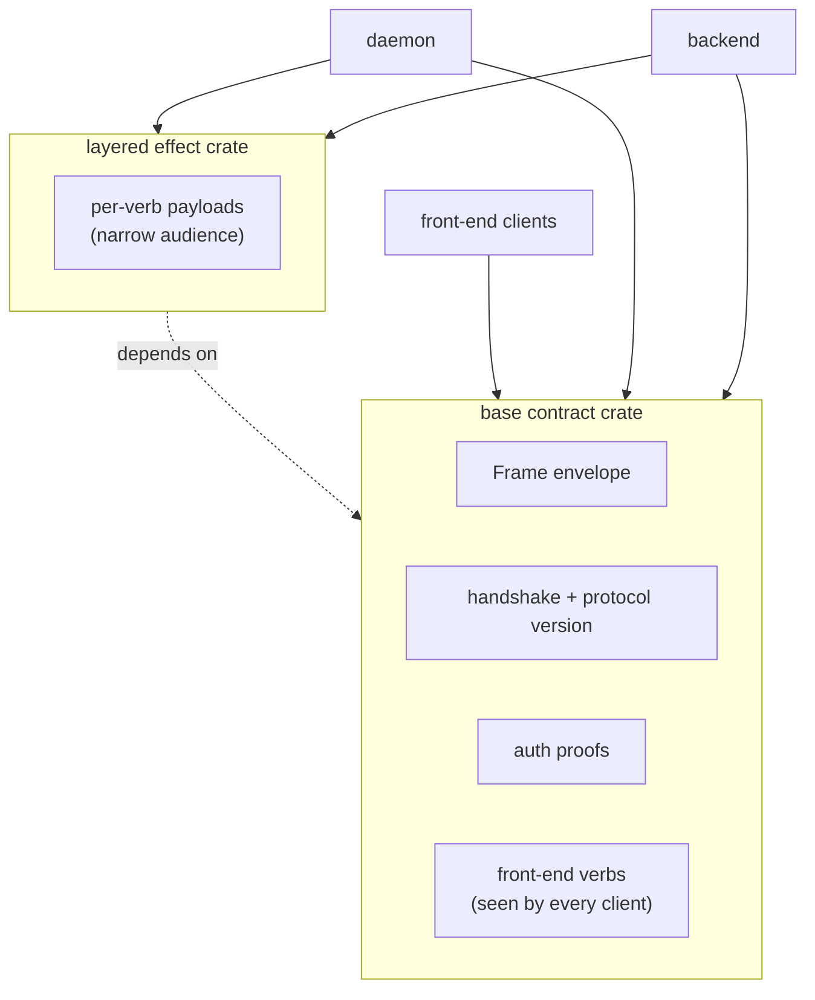

# Skill — contract repos

*The wire contract between Rust components lives in a dedicated
repo of typed records, not duplicated across consumer crates.
Every component on the same fabric depends on the same contract
crate; rkyv archives produced by one are readable by every
other.*

---

## What this skill is for

When two or more Rust components need to talk over a wire — a
Unix socket, TCP, message bus, named pipe, mmap region — the
record types they exchange live in a **contract repo**: one
crate, one home, every consumer pulls it as a dependency. This
skill is *when* you reach for that pattern, *what* belongs in
the contract crate, and *how* it relates to layered protocols
and human-facing text formats.

The principle is `~/primary/ESSENCE.md` §"Perfect specificity at
boundaries" applied across processes. The Rust enforcement
sits on top of `~/primary/skills/rust-discipline.md` §"redb +
rkyv — durable state and binary wire" — this skill names how
the binary contract is *organised* in repos.

The canonical workspace example is **signal**
(`~/primary/repos/signal`) — the wire-protocol crate of the
sema-ecosystem. Read its `ARCHITECTURE.md` once before designing
a new contract repo; the shape is concrete there.

---

## Why a contract repo exists

rkyv archives interoperate **only** when both ends compile
against the same types with the same feature set. Three
consequences make a shared crate the right home:

- **Schema agreement.** A `Frame` defined in one component and
  redefined in another is two types — the bytes don't round-
  trip even if the field lists look identical. The contract
  crate is the single definition.
- **Derive sharing.** `Archive`, `RkyvSerialize`,
  `RkyvDeserialize`, `bytecheck`, plus any project-specific
  derive (`NotaRecord`, `NexusPattern`) all live with the
  type. Re-deriving in each consumer is dead code at best,
  drift at worst.
- **Front-end stability.** When a layered effect crate adds
  per-verb payloads (e.g. signal-forge over signal), front-end
  clients that depend only on the base contract don't recompile
  on layered-crate churn. Audience-scoped compile-time
  isolation.

A workspace pattern that doesn't follow this:
- types defined in component A, copy-pasted into component B,
- two components own "the same" wire format,
- bytes silently drift on schema changes.

This is exactly the class of bug rkyv's strict layout makes
invisible (no parse error, just wrong values).

---

## What goes in a contract repo

```
contract-repo/
├── src/
│   ├── lib.rs        — module entry + re-exports
│   ├── frame.rs      — Frame envelope, encode/decode, error type
│   ├── handshake.rs  — ProtocolVersion + handshake exchange
│   ├── auth.rs       — auth-proof types (capability tokens, signatures)
│   ├── request.rs    — Request enum (closed; per-verb dispatch)
│   ├── reply.rs      — Reply enum (closed; matches request kinds)
│   ├── <verb>.rs     — per-verb typed payloads
│   ├── <kind>.rs     — domain record kinds + paired *Query types
│   └── error.rs      — crate Error enum (thiserror)
├── tests/            — round-trip per record kind, per verb
├── Cargo.toml        — pinned rkyv feature set, versioned
└── ARCHITECTURE.md   — what's owned, what's not, schema discipline
```

The contract crate **owns**:

- The `Frame` envelope and its `encode` / `decode` methods.
- Length-prefix framing rule (4-byte big-endian per archive).
- Handshake + protocol version + compatibility rule
  (major-exact / minor-forward, or whatever the project picks).
- Auth-proof types and capability-token shape.
- The closed enum of request kinds + paired reply kinds.
- Per-verb typed payloads (closed enums of typed kinds — no
  generic record wrapper, no `Unknown` variant).
- The version-skew guard's known-slot record (schema +
  wire-format version).
- A complete round-trip test per record kind.

It **does not own**:

- Daemon code. No actors, no runtime, no `tokio`.
- Component-internal state. Each daemon's redb tables, its
  reducer state, its supervisor tree are private.
- Logic that interprets the records. Validation pipelines,
  routing rules, gate decisions stay in the daemons.
- Text formats. Human-facing projections live in their own
  codec crate (e.g. `nota-codec`); the contract crate's wire
  is binary.
- Configuration. `Cargo.toml`, `flake.nix`, deployment.
- `serde`. Contract types may *also* derive serde for debug
  rendering, but the contract is rkyv-on-the-wire.

---

## The layered pattern

When a wire protocol has audience-scoped concerns — verbs that
only a subset of components care about — those verbs land in a
**layered effect crate**, not in the base contract:



The pattern (signal-forge over signal is the canonical
example): the layered crate **re-uses** the base contract's
`Frame`, handshake, and auth, and **adds** its own per-verb
payload enum. New layered verbs land in the layered crate;
front-end clients that depend only on the base contract don't
recompile.

Use a layered crate when:

- The verbs have a narrow audience (sender + receiver +
  maybe one transitional caller, not "every client").
- The base contract would otherwise grow to absorb effect-
  specific concerns that don't belong on the front-end
  surface.
- Recompile cost across the front-end surface is real (signal
  has many front-end clients; recompile churn matters).

Don't pre-layer. A second contract crate's layered shape
becomes obvious after one effect-bearing leg is real and a
second is being added.

---

## Versioning is the wire

The contract crate's semver **is** the wire's semver:

- A bumped major means breaking layout or breaking semantics.
  Every consumer upgrades together. Coordinated upgrade.
- A bumped minor means a backward-compatible addition (new
  variant in a forward-tolerant enum, new optional field).
  Forward-compatible enums must be marked open in their
  decoding strategy; closed enums never accept minor
  additions.
- A bumped patch is documentation, tests, internal cleanup.
  No layout change, no semantic change.

Pin the contract crate version in every consumer's
`Cargo.toml`. Don't `git = "..."` against `main` for
production wire — `main` moves under your feet. Use a tag
or a version-pinned crates.io release.

The **version-skew guard** is part of the wire: a known-slot
record at the canonical key carrying `(schema_version,
wire_version)`, checked at boot. Hard-fail on mismatch. The
guard runs *before* the daemon starts handling traffic; a
mismatch is a coordinated-upgrade signal, not a runtime
error to recover from.

---

## How NOTA fits

NOTA is the project's text format. It is **not the inter-
component wire**. The contract crate carries rkyv types; NOTA
appears only at boundaries that touch a human or a text
projection:

| Boundary | Format |
|---|---|
| Component ↔ component (Rust ↔ Rust) | contract-crate types via rkyv frames |
| CLI ↔ daemon | NOTA on argv/stdin (human types it); daemon parses to typed contract record |
| Daemon ↔ harness terminal | Pre-harness component projects typed record to NOTA before write |
| Audit logs / debug dumps | NOTA projection |

The CLI, the router, and the pre-harness component are the
*only* parts of the system that touch NOTA. Everywhere else, a
component holds typed records (in memory) or rkyv archives (on
disk and on the wire). This is what `~/primary/skills/rust-
discipline.md` §"NOTA — the human-facing projection" already
states; the contract repo is how that discipline gets enforced
at the repo level.

---

## When to introduce a contract repo

Indicators the moment is now, not "later":

- A second component is about to read or write the same wire
  bytes. Two components ⇒ contract crate.
- The first component had its types in a private module. As
  soon as the second component needs them, hoist to a
  contract repo.
- A schema change is being planned and the change needs to
  land in two crates simultaneously. The pain is the signal.

Indicators the moment is **not yet**:

- One daemon, no clients, no other component reads its bytes.
  Keep the types private until a second consumer appears.
- Prototyping a serialization shape; the format will change
  three times this week. Stabilise first, hoist after.

The cost of premature hoisting is a contract repo with one
consumer — fine, low overhead. The cost of late hoisting is a
silent schema-drift bug that survives review because both
copies of the type *look* the same. Err early.

---

## Naming a contract repo

The contract crate is the *protocol the components speak*.
Patterns that work:

- **`<project>-signal`** when the project speaks signal-shaped
  wire — same `Frame` shape, same length-prefix framing, same
  closed-enum-of-typed-payloads discipline as
  `~/primary/repos/signal`. The `-signal` suffix marks family
  membership, not literal layering: a `<project>-signal`
  crate may be layered atop signal today (`signal-forge`,
  `signal-arca`), or stand alone today on a path toward
  convergence with the criome/signal ecosystem. The shared
  name reflects shared design.
- **`<project>-protocol`** or **`<project>-contract`** when
  the project lives in its own ecosystem with a deliberately
  *different* wire shape from signal-family — different
  framing, different envelope, no convergence intended.
  Names what it is.
- **`<project>-wire`** when the focus is on the bytes that
  travel; less semantically rich than -protocol, narrower.

The `-signal` family-membership marker is the right default
when the project follows the same wire conventions, even
without literal layering today. Pre-naming for a future
convergence is appropriate when the convergence is the
explicit destination; pre-naming for a hypothetical
convergence is not.

Don't pick names that name the consumer (`<project>-types`,
`<project>-shared`). The repo isn't a bag of utilities — it
is the spoken protocol.

---

## Common mistakes

| Mistake | What it looks like | Fix |
|---|---|---|
| Types redefined per consumer | Each daemon has its own `Frame` struct with the same fields | One contract crate; every consumer depends on it |
| `serde_json` between Rust components | "We'll switch to rkyv later" | rkyv from the start; if iterating fast, prototype with rkyv too |
| `path = "../contract"` in `Cargo.toml` | Local sibling reference | `git = "..."` with a tag, or a published crates.io version. Cross-crate `path = "../sibling"` is forbidden per ESSENCE §"Micro-components" |
| Contract crate carries logic | Validation, routing, or reducer code in the contract | Move logic to the daemon; contract holds types only |
| Contract crate has a runtime dependency | tokio, ractor, nix system bindings | Contract crate depends only on rkyv + thiserror + (optionally) the project's derive crate |
| New wire verb added to the base contract because it was easy | Front-end clients now recompile on every effect-side change | Add a layered effect crate; base stays stable |
| No `ARCHITECTURE.md` in the contract repo | Schema discipline is unwritten | Every contract repo carries `ARCHITECTURE.md` per `~/primary/lore/AGENTS.md`; schema discipline is the load-bearing part |
| Open enum where closed was meant | Adding `Unknown` variant "for forward compatibility" | Closed enum + coordinated upgrade. The `Unknown` is a polling-shaped escape hatch |

---

## See also

- `~/primary/ESSENCE.md` §"Perfect specificity at boundaries"
  — the principle the contract repo encodes.
- `~/primary/skills/rust-discipline.md` §"redb + rkyv" — the
  Rust-specific rules for the binary contract; this skill
  organises those types into repos.
- `~/primary/skills/micro-components.md` — every component is
  its own repo; the contract crate is the typed protocol
  between them.
- `~/primary/skills/push-not-pull.md` §"Subscription
  contract" — the producer contract for push primitives;
  contract crates own the subscription frame types.
- `~/primary/repos/signal/ARCHITECTURE.md` — the canonical
  worked example.
- `~/primary/repos/signal-forge/ARCHITECTURE.md` — the
  canonical layered effect crate.
- `~/primary/repos/lore/rust/rkyv.md` — the tool reference
  (cargo features, derive aliases, encode/decode API).
- `~/primary/repos/lore/rust/style.md` — Cargo.toml
  conventions, cross-crate dependencies, pin strategy.
