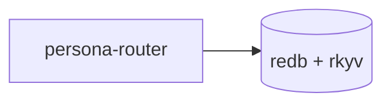
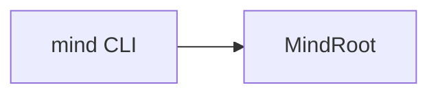
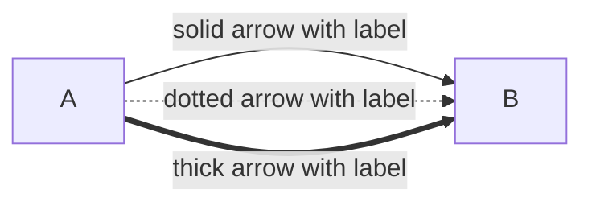
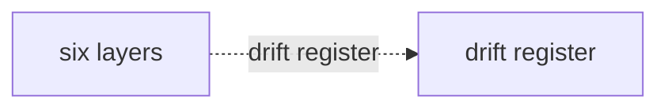
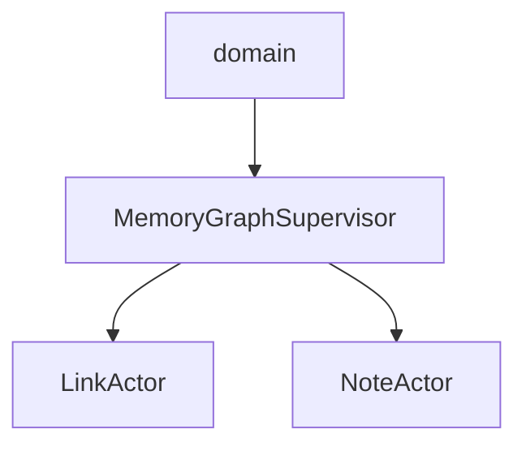
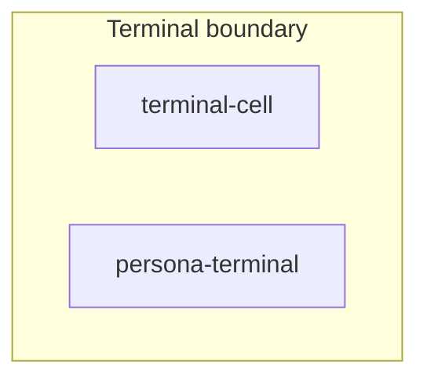
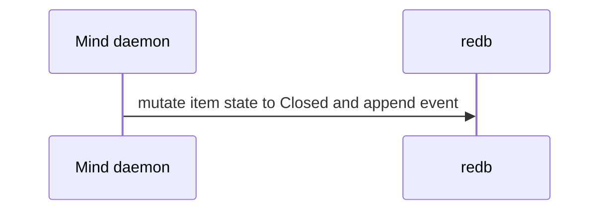
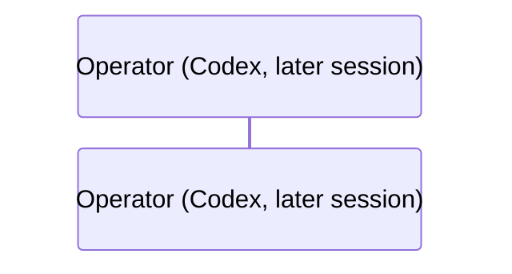

# Skill — Mermaid syntax (workarounds and traps)

*Mermaid renderer quirks that trip report authors. Node labels
are quoted strings; edge labels are pipe-delimited. Mermaid 8.8.0
is stricter than current Mermaid Live in subgraph titles, edge
Unicode, and sequence-diagram punctuation.*

---

## What this skill is for

Use this skill when writing reports, design documents, or essays
that contain Mermaid diagrams. The substance is *what trips the
parser in renderers we care about* — primarily Mermaid 8.8.0
(which Substack ships) and current Mermaid Live (slightly more
permissive but still strict on the rules below).

Pairs with `skills/reporting.md` (which links here for the
syntax workarounds; that skill owns the broader rule "reports
explain shapes via prose + visuals").

---

## Node labels — quoted strings inside brackets

Mermaid's grammar treats **node labels** and **edge labels**
differently. Quoted strings are node-shape syntax; edge labels
use pipes. Mixing them — putting a quoted string where an edge
label belongs — looks plausible and fails to parse.

Quote Mermaid node labels whenever the visible label contains
hyphens, slashes, punctuation, parentheses, or multiple words.
Prefer the bracket form with a quoted label:



Do this even when the renderer appears to accept the unquoted
label. Unquoted punctuation has inconsistent behavior across
Mermaid renderers and can make diagrams misleading or ugly.

---

## Never use bare quoted strings as flowchart node IDs

This is broken in older Mermaid renderers, including Mermaid 8.8.0:

```text
flowchart LR
    "mind CLI" --> "MindRoot"
```

The strings look like visible labels, but the parser treats them
as invalid flowchart node syntax. Always give the node a simple
identifier and put the visible label in brackets:



For maximum compatibility, node IDs should be ASCII identifiers:
lowercase letters, digits, and underscores. The visible label can
still contain spaces and punctuation inside the brackets.

---

## Edge labels — pipe delimiters, NOT quoted strings



The pattern `A --> "label" --> B` looks like it should work —
quoted strings are how node labels work, after all — but
Mermaid's parser rejects it. **Quoted strings are node shapes;
edge labels go in pipes.**

Pattern that broke (durable record, designer/68 v1):

```
layers -.- "drift register" -.- gaps
```

Failed with:

```
Parse error on line 12:
...nd    layers -.- "drift register" -.-
---------------------^
Expecting 'AMP', 'COLON', 'PIPE', 'TESTSTR', 'DOWN',
'DEFAULT', 'NUM', 'COMMA', 'NODE_STRING', 'BRKT', 'MINUS',
'MULT', 'UNICODE_TEXT', got 'STR'
```

(Note `'PIPE'` in the expected-token list — that's the parser
telling you it wanted `|label|`.)

Right form:



The same rule applies to all edge variants: `-->`, `-.->`,
`==>`, `---`, `-.-`, `===`. None of them accept a quoted string
in the edge position; all of them accept a pipe-delimited label
after the arrow head.

---

## Avoid Mermaid reserved-word node IDs

Mermaid reserves identifiers across diagram types — notably
`graph`, `flowchart`, `subgraph`, `end`, `class`, `classDef`,
`style`, `link`, `linkStyle`, `note`, `click`, `direction`. Using
any of these as a **node ID** in a flowchart breaks the parser,
especially in older renderers (Substack ships Mermaid 8.8.0,
which is strict about keyword collisions across contexts; the
failure mode is a "Syntax error in graph" image where the diagram
should be). Mermaid 8.8.0 can also collide on underscore-
separated ID segments, so avoid IDs like `mind_graph`,
`state_link`, or `audit_note`. Use a noun that dodges the keyword
entirely: `mind_work`, `state_route`, `audit_record`.

A node like `graph["MemoryGraph"]` looks fine but the parser sees
the `graph` keyword. Same for `link["LinkActor"]` and
`note["NoteActor"]`. The label inside the brackets is fine; only
the node ID needs to dodge the keyword.

Right form — suffix node IDs by what they are:



Convention for actor-topology diagrams (which collide with
keywords most often):

| Concern | Suffix | Example |
|---|---|---|
| Actor node ID | `_actor` | `link_actor["LinkActor"]` |
| Supervisor node ID | `_supervisor` | `graph_supervisor["MemoryGraphSupervisor"]` |
| Table actor node ID | `_table` | `note_table["NoteTableActor"]` |
| View actor node ID | `_view` | `ready_view["ReadyWorkViewActor"]` |

The labels render unchanged; the suffix dodges the parser
silently. Default to suffixing all node IDs in actor diagrams —
it's cheap and prevents the failure mode where the diagram
displays as the bomb-icon error on rendered surfaces (Substack,
GitHub, internal docs).

---

## Mermaid 8.8-safe labels

Mermaid 8.8.0 is stricter than current Mermaid Live in places
agents often hit when writing prose-heavy diagrams. Keep diagram
syntax ASCII-simple and put prose in labels, not in identifiers
or parser-sensitive punctuation.

### Subgraphs

Use the Mermaid 8.8-safe form:



Rules:

- Put a space between the subgraph identifier and the title
  bracket: `subgraph terminal_group [Terminal boundary]`. Do not
  use the newer no-space quoted-bracket form
  `subgraph terminal_group["Terminal boundary"]`; Mermaid 8.8.0
  rejects it.
- Do not put quotes inside the subgraph title bracket. Use
  `[Terminal boundary]`, not `["Terminal boundary"]`.
- Do not write `direction TB` or `direction LR` inside a
  subgraph. Mermaid 8.8.0 does not support subgraph-local
  direction; the subgraph inherits the parent flowchart direction.
- Keep subgraph titles punctuation-light. Avoid parentheses,
  slashes, semicolons, and arrows; use commas, `and`, or a
  shorter title.

### Flowchart edge labels

Avoid Unicode arrows such as `↔` and `→` inside `|label|`. Write
`to`, `from`, `and`, or split the edge. These labels read fine
to humans and do not trip the lexer.

### Sequence diagrams

Do not put semicolons in participant aliases or message text.
Mermaid 8.8.0 treats `;` as a statement boundary, so a line like
this can fail even though the sentence is understandable:

```text
Daemon->>Redb: mutate item state to Closed; append event
```

Right form:



The same rule applies to participant aliases:

```text
participant Op as Operator (Codex; later session)
```

Use commas or words instead:



When a sequence message wants a chain of actions, prefer separate
messages or a comma-separated label over arrows, semicolons,
shell punctuation, or markdown/HTML. The diagram is a topology
artifact, not a transcript.

---

## Diagnostic — parse before publishing

Parse the raw Mermaid block with the target renderer version
whenever you know it. For Substack or another Mermaid 8.8.0
surface, a current Mermaid Live render is not sufficient because
it may accept syntax 8.8.0 rejects. The parse error is the only
signal you'll get from the markdown itself — GitHub-flavoured
markdown silently shows the failed-to-parse block as the literal
source on render failure, which is easy to miss in review.

---

## See also

- `skills/reporting.md` — when to write reports, where they live,
  and the broader "prose + visuals" rule that brings you here.
- `skills/skill-editor.md` — skill writing conventions.
