# Skill — Mermaid syntax (workarounds and traps)

*Mermaid renderer quirks that trip report authors. Node labels
are quoted strings; edge labels are pipe-delimited. Mermaid 8.8.0
is stricter than current Mermaid Live in subgraph titles, edge
Unicode, and sequence-diagram punctuation. Readability is part of
correctness: a clipped or text-dense graph is a failed graph.*

## What this skill is for

Use this skill when writing reports, design documents, or essays
that contain Mermaid diagrams. The substance is *what trips the
parser in renderers we care about* — primarily Mermaid 8.8.0
(which Substack ships) and current Mermaid Live (slightly more
permissive but still strict on the rules below).

Pairs with `skills/reporting.md` (which links here for the
syntax workarounds; that skill owns the broader rule "reports
explain shapes via prose + visuals").

## Node labels — quoted strings inside brackets

Mermaid's grammar treats **node labels** and **edge labels**
differently. Quoted strings are node-shape syntax; edge labels
use pipes. Mixing them — putting a quoted string where an edge
label belongs — looks plausible and fails to parse.

Quote Mermaid node labels whenever the visible label contains
hyphens, slashes, punctuation, parentheses, or multiple words.
Prefer the bracket form with a quoted label:

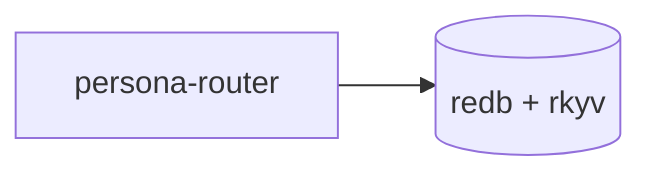

Do this even when the renderer appears to accept the unquoted
label. Unquoted punctuation has inconsistent behavior across
Mermaid renderers and can make diagrams misleading or ugly.

## Total graph size — 4-8 nodes, factor bigger graphs into focused pieces

Per intent record on this skill (2026-05-27): big graphs are
unreadable. The reader's eye can hold a topology of ~5-8 nodes
before the diagram becomes a wall of boxes; past that, edges
crisscross, layout heuristics give up, and the reader scrolls
sideways to see the right edge of the canvas.

**Aim for 4-8 nodes per diagram. Hard cap around 10.** When the
substance needs more than that, the diagram has stopped being a
topology artifact and started being a system map; **split it into
multiple focused diagrams**, each showing ONE aspect:

- One diagram for the data flow (what travels where).
- One diagram for the type lineage (how types derive).
- One diagram for the control flow (who calls whom).
- One diagram for the failure modes (what errors when what breaks).

Each diagram answers ONE question; together they cover the
substance. The reader takes each in at a glance, then composes
the mental model across diagrams via the surrounding prose.

The same principle applies to subgraphs: a diagram with three
subgraphs of 5 nodes each is still 15 nodes total on the canvas
and reads as one big diagram. If the substance partitions
cleanly, the partitions are usually better as siblings —
multiple top-level diagrams in the same report — than as
subgraphs inside one master diagram.

**The test**: can a reader take in the topology in one glance,
without scrolling or scanning? If no, the diagram is too big —
factor.

**Counter-pressure**: don't fragment to the point of confusion.
A 3-node diagram is fine when 3 nodes IS the topology; padding
to "look more substantial" is the opposite mistake. Match the
diagram size to the substance, not to a target token count.

## Label sizing — short prose, readable boxes, IDs out of the node

Per spirit record 368 (Maximum) and spirit record 1031 (Medium).
Mermaid renderers clip node text at the box width; long labels
truncate mid-word and the reader sees neither the head nor the
tail. The cure is upstream: write labels short enough to fit and
wrap them deliberately.

**Aim for 2-5 words per node label.** Describe what the node IS —
a noun phrase that names the concept. The reader scans the
diagram for topology and concepts, not for IDs.

**Default visible-character budget:**

- one-line node label: **24-28 visible characters**;
- edge label: **1-3 words**.

If a label needs more, the node is doing prose's job. Shorten the
node and move the detail to the surrounding paragraph, caption, or
sibling table.

### Node labels stay single-line

Do not insert manual line breaks into Mermaid labels. Escaped
newlines (`\n`) are not respected consistently and often render as
literal noise. HTML breaks (`<br/>`) and markdown wrapping behave
differently across Mermaid versions and report surfaces. A graph
that depends on label line breaks is not portable.

Wrong:

```text
flowchart LR
    schema["schema/lib.schema\nfull-NOTA source"]
    schemaInRust["schema-in-Rust\ntyped rkyv image"]
    schema --> schemaInRust
```

Also wrong:

```text
flowchart LR
    schema["schema/lib.schema<br/>full-NOTA source"]
    schemaInRust["schema-in-Rust<br/>typed rkyv image"]
    schema --> schemaInRust
```

Right:

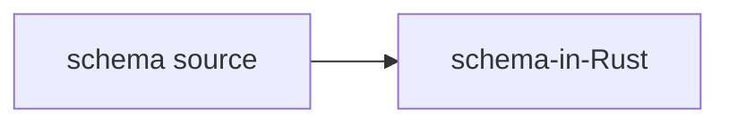

The detail moves into the paragraph before or after the graph:
`schema source` means `schema/lib.schema`, a full-NOTA document;
`schema-in-Rust` means the typed, rkyv-serializable image the
structural-macro-node codec deserializes that source into (per record
`vez8`; there is no separate assembled `Asschema` step).

If one compact label cannot carry the concept, split the concept
into separate nodes or remove the detail from the graph. Do not
simulate a paragraph inside a box.

Mermaid does not offer a dependable fixed `width` / `height` knob
for ordinary flowchart nodes across renderers. Some controls are
partial:

- `flowchart.wrappingWidth` sets the max text width before markdown
  node labels wrap in newer Mermaid renderers.
- `flowchart.padding` increases label-to-shape padding only in the
  newer experimental rendering path.
- `classDef roomy padding:18px;` is a practical workaround in many
  renderers, but still does not promise a fixed box width.

References: Mermaid's Flowchart Diagram Config documents
`wrappingWidth` as the node text wrapping width and `padding` as
label/shape padding; Mermaid's Flowchart syntax page documents
Markdown Strings and automatic wrapping. Community practice also
uses `classDef` padding as the least-bad box-size workaround.

Use padding only to give short labels breathing room:

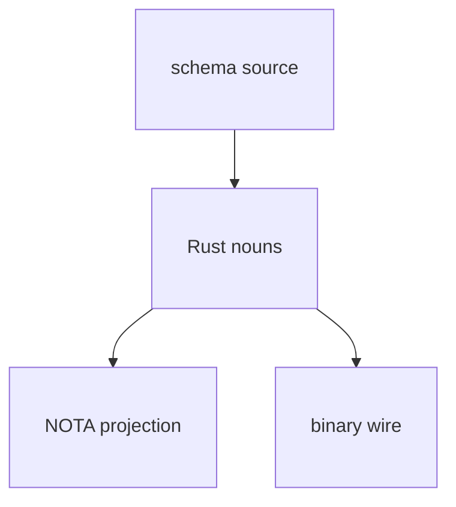

For current Mermaid renderers that support config blocks, this can
help, but it does not make long labels acceptable:

````text
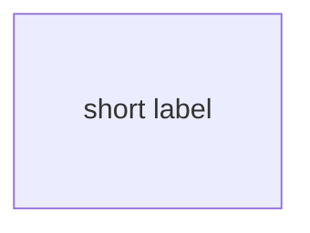
````

Before finishing a report, inspect any Mermaid graph in the target
surface or from a screenshot. If any label clips, truncates, forces
sideways scrolling, or becomes illegible at the report column width,
the graph must be rewritten before the report is considered done.

**Disfavour ID-laden tokens inside nodes:**

- Bead IDs (`primary-li0p`, `primary-ezqx`, …) — consume width,
  decodable only by someone with `bd show` already open.
- Full file paths (`signal-frame/src/namespace.rs:55-86`) —
  belong in surrounding prose or a citation table.
- Long identifier names (`emit_contract_section`,
  `assert_triad_sections!`) — usually a short prose label
  (`section attribute`, `triad witness`) carries the same
  meaning without the underscores eating the box.
- Section locators (`§1.6.7`, `/315 §2.2`) — also belong
  outside the node.
- Multi-part conjunctions (`Foo + Bar + Baz (qualifier)`) —
  truncate badly; usually want to be split into multiple nodes
  or compressed into one short noun.

**The diagram-and-table pair.** When the substance you want to
convey includes bead IDs, file paths, or citations, the right
shape is:

1. **The diagram.** Short prose labels only. Reader sees
   topology.
2. **A sibling table immediately below.** Columns: short prose
   label (matching the node), the ID or path, optionally a
   one-line description.

The diagram conveys *what relates to what*; the table conveys
*what each thing IS in the workspace*. Splitting these into two
surfaces lets each be the right shape for its job.

Wrong (label truncates mid-word):

```text
flowchart TB
    n1["primary-li0p · NamespaceSection + SECTION_CUTOFF + classify"]
    n2["primary-avog · assert_triad_sections! macro"]
    n3["Slot 1 · emit_contract_section · primary-v5n2"]
    n1 --> n3
    n2 --> n3
```

Right (short labels + sibling table):

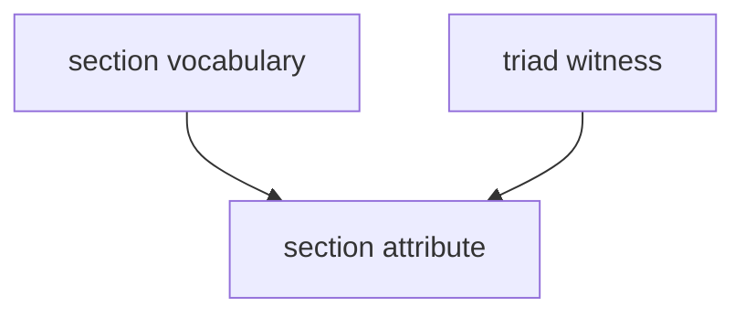

| Node label | Bead | Adds |
|---|---|---|
| section vocabulary | `primary-li0p` | `NamespaceSection` + `SECTION_CUTOFF` + `classify` |
| triad witness | `primary-avog` | `assert_triad_sections!` macro |
| section attribute | `primary-v5n2` | `contract_section:` grammar + emit |

**Subgraph titles follow the same discipline.** A subgraph
title is even more constrained than a node label because
Mermaid 8.8.0 doesn't quote them and the rendered surface
truncates them too. 3-5 words; no parentheticals (`(one PR,
…)`, `(parallelisable)`); no bead IDs.

Wrong:

```text
subgraph macro ["Macro convergence epic — primary-ezqx (one PR, one signal-frame-macros/src/emit.rs extension)"]
```

Right:

```text
subgraph macro [Macro convergence epic]
```

The parenthetical detail moves to the prose under the diagram or
the sibling table.

**Edge labels follow the same discipline.** Inline-summarise the
edge relationship in 1-3 words: `depends on`, `runs before`,
`feeds`, `broadcasts to`. Avoid long parentheticals or bead IDs
inside the pipes.

## Edge labels are prose, not notation

Pipe-delimited flowchart edge labels are still lexer-sensitive.
Do not put sigil-prefixed notation tokens in edge labels; a label
starting with sigils or punctuation can be tokenised as a link-style
identifier and fail with a `LINK_ID` parse error.

Wrong:

```text
flowchart LR
    entry["syntax label with punctuation"] -->|@derive| lowered["TypeValue::Struct"]
```

Right:

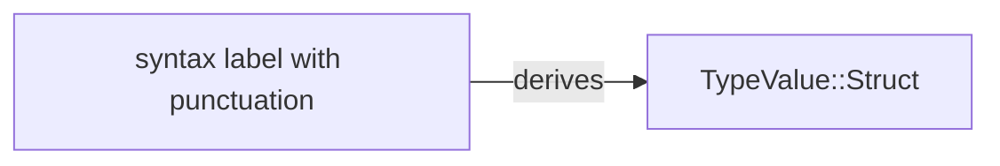

Use edge labels for the relationship in plain prose: `derives`,
`lowers`, `feeds`, `projects`. Put literal notation tokens in the
node label, the surrounding prose, or a sibling table. If the
edge only makes sense with a syntax token inside it, the diagram
is carrying prose; shorten the edge and explain the token outside
the graph.

## Never use bare quoted strings as flowchart node IDs

This is broken in older Mermaid renderers, including Mermaid 8.8.0:

```text
flowchart LR
    "mind CLI" --> "MindRoot"
```

The strings look like visible labels, but the parser treats them
as invalid flowchart node syntax. Always give the node a simple
identifier and put the visible label in brackets:

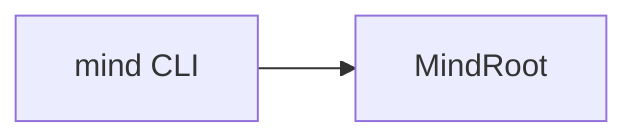

For maximum compatibility, node IDs should be ASCII identifiers:
lowercase letters, digits, and underscores. The visible label can
still contain spaces and punctuation inside the brackets.

## Edge labels — pipe delimiters, NOT quoted strings

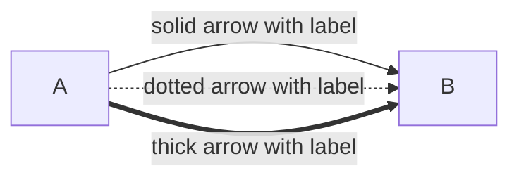

The pattern `A --> "label" --> B` looks like it should work —
quoted strings are how node labels work, after all — but
Mermaid's parser rejects it. **Quoted strings are node shapes;
edge labels go in pipes.**

Pattern that broke (durable record, designer/68 v1):

```
layers -.- "drift register" -.- gaps
```

Failed with:

```
Parse error on line 12:
...nd    layers -.- "drift register" -.-
---------------------^
Expecting 'AMP', 'COLON', 'PIPE', 'TESTSTR', 'DOWN',
'DEFAULT', 'NUM', 'COMMA', 'NODE_STRING', 'BRKT', 'MINUS',
'MULT', 'UNICODE_TEXT', got 'STR'
```

(Note `'PIPE'` in the expected-token list — that's the parser
telling you it wanted `|label|`.)

Right form:

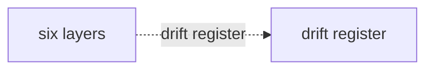

The same rule applies to all edge variants: `-->`, `-.->`,
`==>`, `---`, `-.-`, `===`. None of them accept a quoted string
in the edge position; all of them accept a pipe-delimited label
after the arrow head.

## Avoid Mermaid reserved-word node IDs

Mermaid reserves identifiers across diagram types — notably
`graph`, `flowchart`, `subgraph`, `end`, `class`, `classDef`,
`style`, `link`, `linkStyle`, `note`, `click`, `direction`. Using
any of these as a **node ID** in a flowchart breaks the parser,
especially in older renderers (Substack ships Mermaid 8.8.0,
which is strict about keyword collisions across contexts; the
failure mode is a "Syntax error in graph" image where the diagram
should be). Mermaid 8.8.0 can also collide on underscore-
separated ID segments, so avoid IDs like `mind_graph`,
`state_link`, or `audit_note`. Use a noun that dodges the keyword
entirely: `mind_work`, `state_route`, `audit_record`.

A node like `graph["MemoryGraph"]` looks fine but the parser sees
the `graph` keyword. Same for `link["LinkActor"]` and
`note["NoteActor"]`. The label inside the brackets is fine; only
the node ID needs to dodge the keyword.

Right form — suffix node IDs by what they are:

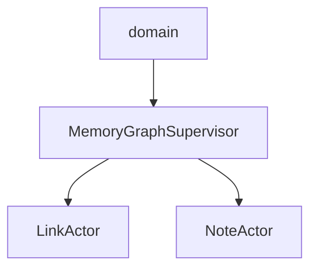

Convention for actor-topology diagrams (which collide with
keywords most often):

| Concern | Suffix | Example |
|---|---|---|
| Actor node ID | `_actor` | `link_actor["LinkActor"]` |
| Supervisor node ID | `_supervisor` | `graph_supervisor["MemoryGraphSupervisor"]` |
| Table actor node ID | `_table` | `note_table["NoteTableActor"]` |
| View actor node ID | `_view` | `ready_view["ReadyWorkViewActor"]` |

The labels render unchanged; the suffix dodges the parser
silently. Default to suffixing all node IDs in actor diagrams —
it's cheap and prevents the failure mode where the diagram
displays as the bomb-icon error on rendered surfaces (Substack,
GitHub, internal docs).

## Mermaid 8.8-safe labels

Mermaid 8.8.0 is stricter than current Mermaid Live in places
agents often hit when writing prose-heavy diagrams. Keep diagram
syntax ASCII-simple and put prose in labels, not in identifiers
or parser-sensitive punctuation.

### Subgraphs

Use the Mermaid 8.8-safe form:

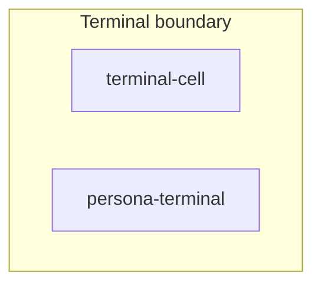

Rules:

- Put a space between the subgraph identifier and the title
  bracket: `subgraph terminal_group [Terminal boundary]`. Do not
  use the newer no-space quoted-bracket form
  `subgraph terminal_group["Terminal boundary"]`; Mermaid 8.8.0
  rejects it.
- Do not put quotes inside the subgraph title bracket. Use
  `[Terminal boundary]`, not `["Terminal boundary"]`.
- Do not write `direction TB` or `direction LR` inside a
  subgraph. Mermaid 8.8.0 does not support subgraph-local
  direction; the subgraph inherits the parent flowchart direction.
- Keep subgraph titles punctuation-light. Avoid parentheses,
  slashes, semicolons, and arrows; use commas, `and`, or a
  shorter title.

### Flowchart edge labels

Avoid Unicode arrows such as `↔` and `→` inside `|label|`. Write
`to`, `from`, `and`, or split the edge. These labels read fine
to humans and do not trip the lexer.

### Sequence diagrams

Do not put semicolons in participant aliases or message text.
Mermaid 8.8.0 treats `;` as a statement boundary, so a line like
this can fail even though the sentence is understandable:

```text
Daemon->>Redb: mutate item state to Closed; append event
```

Right form:

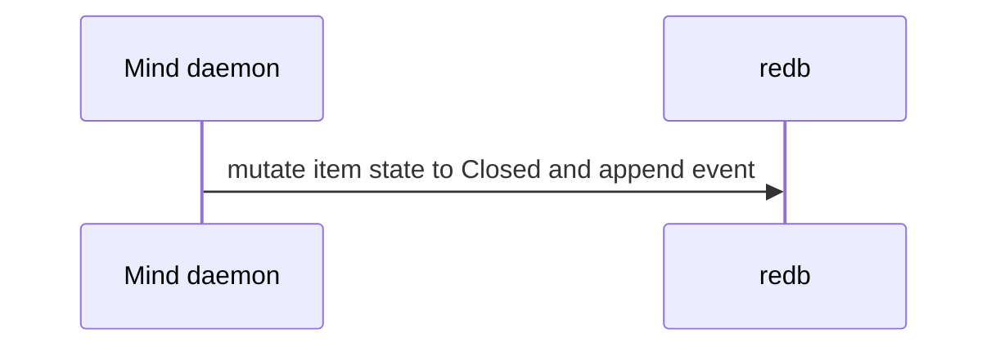

The same rule applies to participant aliases:

```text
participant Op as Operator (Codex; later session)
```

Use commas or words instead:

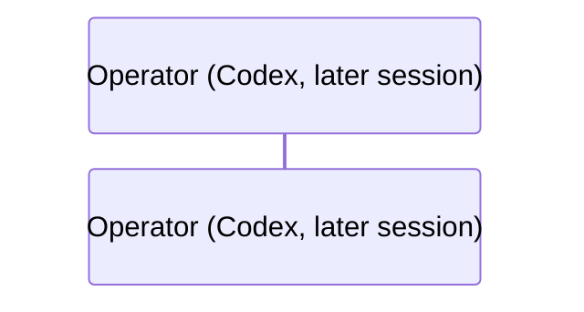

When a sequence message wants a chain of actions, prefer separate
messages or a comma-separated label over arrows, semicolons,
shell punctuation, or markdown/HTML. The diagram is a topology
artifact, not a transcript.

The same semicolon rule applies inside `Note over`, `Note left of`,
`Note right of` text. A note line like

```text
Note over New,Sup: New daemon aborts handover; reports to supervisor
```

trips the parser the same way a message would. Use "and", a comma,
or split into two notes.

Arrow operators with letters in them — `-x` (solid cross),
`--x` (dotted cross), `-)` (solid point), `--)` (dotted point) —
must have whitespace separating the actors from the arrow.
Confirmed-failing form from a recent report:

```text
Cli-xOld: connection refused
```

The lexer reads `Cli-xOld` as a single identifier token and the
parse explodes a few lines later with a confusing error pointing
elsewhere. Always insert spaces:

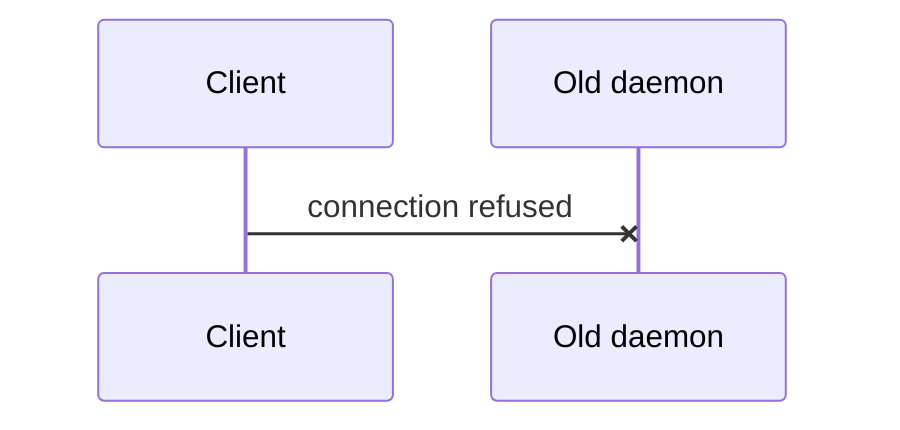

The plain `->>` and `-->>` arrows do not require the spacing (the
lexer recognises `->>` even when wedged between identifiers), but
the spaced form is more readable; default to spaces around all
arrows.

### State diagrams

`stateDiagram-v2` carries the same semicolon-as-statement-boundary
behaviour as sequence diagrams. Transition labels (`StateA -->
StateB: label`) MUST NOT contain semicolons. Use "and" or split
into separate transitions.

Wrong (semicolons in transition labels, all silently breaking):

```text
stateDiagram-v2
    Diverged --> Serving: abort handover; resume serving
    SocketBinding --> Completing: bind sockets; send HandoverCompleted
    Serving --> [*]: long-lived; serves clients
```

Right:

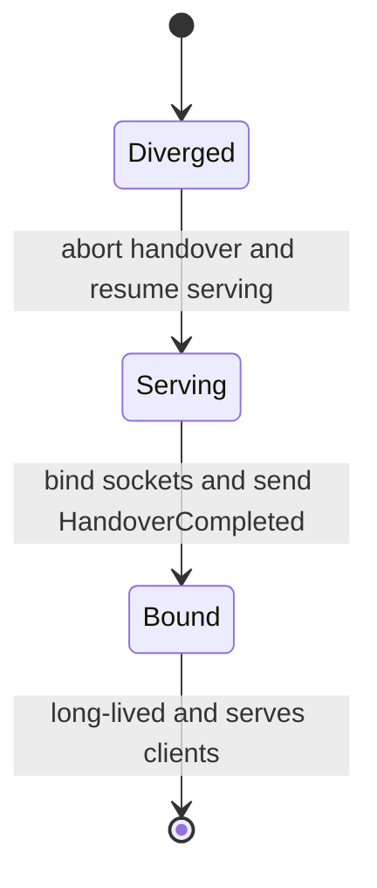

State names follow the same short-prose rule as node labels:
PascalCase nouns of 1-3 words. Long descriptions in state names
overlap with neighbouring states; if a state needs more than a
short noun, move the description into the surrounding prose or a
sibling table.

### Long descriptions in any label position

The §"Label sizing" rule (short prose, IDs in sibling tables)
applies UNIFORMLY across label positions, not just flowchart node
labels. The same overlap-truncation problem hits:

- sequence-diagram message text (`A->>B: long message text...`)
- state-diagram transition labels (`A --> B: long label text...`)
- flowchart edge labels (`A -->|long pipe label| B`)
- subgraph titles (already covered above)
- Note text (`Note over A,B: long note text...`)

For any of these: if the substance needs more than ~5 words, the
diagram has stopped carrying topology and started carrying prose.
Factor the explanation OUT of the diagram into the surrounding
report text, and keep the diagram label to the 1-5 word noun or
verb phrase that names the topology.

## Diagnostic — parse before publishing

Parse the raw Mermaid block with the target renderer version
whenever you know it. For Substack or another Mermaid 8.8.0
surface, a current Mermaid Live render is not sufficient because
it may accept syntax 8.8.0 rejects. The parse error is the only
signal you'll get from the markdown itself — GitHub-flavoured
markdown silently shows the failed-to-parse block as the literal
source on render failure, which is easy to miss in review.

## See also

- `skills/reporting.md` — when to write reports, where they live,
  and the broader "prose + visuals" rule that brings you here.
- `skills/skill-editor.md` — skill writing conventions.
