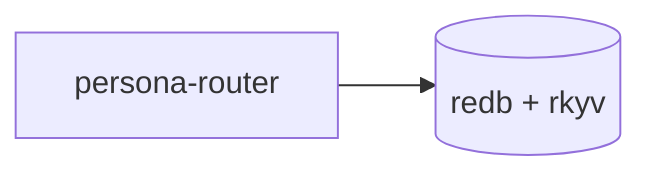
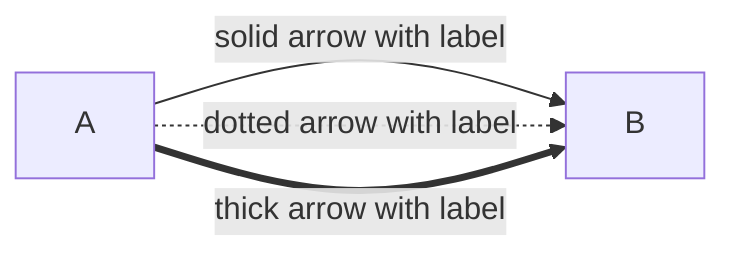
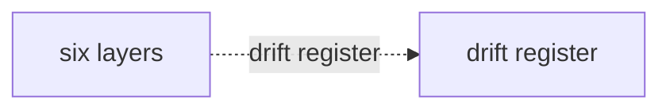

# Skill — reporting

*How to write reports, when to write them vs answer in
chat, where they live, and how to reference them. Required
reading for autonomous agents.*

---

## What this skill is for

Whenever you produce output that explains, proposes,
analyses, or summarises — apply this skill before posting
to the chat. Reports go in files; chat carries pointers.
This skill names the boundary between the two and the
discipline that keeps both clean.

---

## When to write a report vs answer in chat

If your output would be more than a few lines of substance,
**write a report** in the appropriate `reports/<role>/`
subdirectory and reduce the chat reply to a one-line
pointer.

Two reasons:

1. **Chat UIs are poor reading interfaces.** Files are
   easier — scrollable, searchable, linkable, persistent.
2. **The user reviews asynchronously while you continue.**
   The substance must live in a stable, scrollable,
   file-backed place; chat is ephemeral.

Small reports are fine — the report doesn't have to be
long. Acknowledgements, tool-result summaries, "done;
pushed" confirmations don't need reports. Anything that
explains, proposes, analyses, or summarises does.

---

## Tone in chat replies

**State results. Don't narrate process; don't apologise;
don't pre-announce what you're about to do.** The chat
reply is for what changed and what's next. The *how* and
the *why* belong in the report, not in chat.

---

## Always name paths

When you reference a report or any other file the user
might want to navigate to, **name its path explicitly.**

> "Two reports landed: `reports/designer/11-persona-audit.md`
> and `reports/designer/12-no-polling-delivery-design.md`."

…not "two reports landed" without paths. The chat is a
**navigation surface, not a teaser.** Make the user able
to open the file without guessing.

The same rule applies to any file the chat references —
name it explicitly with its path. If the chat says "I
edited the schema," the path of the schema file goes in
the next clause.

---

## Where reports live

Each role owns a subdirectory under `~/primary/reports/`:

- `reports/operator/`
- `reports/operator-assistant/`
- `reports/designer/`
- `reports/designer-assistant/`
- `reports/system-specialist/`
- `reports/poet/`

These are **exempt from the claim/release flow** — agents
write reports without coordinating a lock. Each role
writes only into its own role subdirectory; reading any
other role's reports is free.

If you want to **build on** another role's report, rewrite
the relevant content in a new report inside your own
subdirectory. Don't edit another role's reports.

For per-repo reports (specific to one repo's work), the
convention is the same `<N>-<topic>.md` shape under
`<repo-root>/reports/`. See that repo's own `AGENTS.md` /
`ARCHITECTURE.md` for any per-repo refinements.

### Filename convention

**`<N>-<topic>.md`** where `N` is the next integer after the
**highest-numbered report in this role's subdirectory.** The
numbering is **per-role, not workspace-wide.** **No leading
zeros. No date prefix.**

Examples for `reports/designer/`:

- `4-persona-messaging-design.md`
- `12-no-polling-delivery-design.md`
- `13-niri-input-gate-audit.md`

To find the next number, scan **only the current role's
subdir** and take one above the maximum:

```sh
ls ~/primary/reports/<role>/ | grep -E '^[0-9]+-' \
  | sort -t- -k1,1n | tail -1
```

Then `N = (that number) + 1`.

The number is a stable identifier within that role — once
assigned, it does not change. The git log captures the
lineage if a report gets updated.

**Numbering is per-role.** Each role manages its own sequence.
`reports/operator/97-…md` and `reports/designer/97-…md` can
coexist; the role subdirectory in the path is the
disambiguator, not the number. A fresh agent looking at a
single role's subdir sees a coherent chronological sequence
for that role's work.

**Why per-role.** Roles work in parallel and produce reports
on independent cadences. A workspace-wide rule forces every
agent to scan every other role's subdir before numbering and
makes parallel landings collide; per-role numbering lets each
role count its own work without coordinating with peers. When
two reports cite each other across roles, the path
(`reports/<role>/<N>-...md`) carries the disambiguation.

**Cross-references between roles always include the subdir:**
`reports/operator/97-...md` — the role subdir names the
author; the number names the position in *that role's*
sequence.

**Numbers are not reused after deletion within a role.** When
a stale report is removed (see Hygiene below), its number
stays retired in that role's subdirectory. The next report in
that role takes the next-highest-plus-one *within that role's
subdir*, not the freed number. Gaps in a role's listing are a
visible signal that something was retired; the commit history
holds the deleted content.

**Why no dates:** dates collide when more than one report
lands in a day, and the date itself is noise once you have
a unique number. Commit timestamps already record when each
report landed; the filesystem doesn't need to repeat that.

**Why no leading zeros:** numeric-aware sort tools (`ls -v`,
`sort -n`, `sort -t- -k1,1n`) handle non-padded numbers
correctly. Padding adds noise at the cost of needing to
know the maximum digit count up front; the count grows
without warning.

---

## Hygiene — soft cap, supersession, periodic review

A role's `reports/` subdirectory is a working surface, not
an archive. The git log preserves everything; the filesystem
should hold only what's currently load-bearing.

### Soft cap: 12 reports per role subdirectory

When a role's subdir reaches 12 reports, **the next agent
working in that subdir reviews the older reports** before
adding a 13th. The cap is soft — it's a trigger for review,
not a hard limit that blocks new work. The aim is to keep
the surface small enough that a fresh reader can scan the
listing and understand what's currently active.

### Supersession deletes the older report

When a new report **replaces** an older one — a fresh audit
of the same target, a redesign that obsoletes the prior
design, an architectural pass that supersedes a transitional
sketch — **delete the older report in the same commit that
lands the new one.** The substance lives in the new report;
the lineage lives in the commit history. Don't accumulate
"v1, v2, v3" reports side-by-side.

Before deleting, **update cross-references** in surviving
reports to point at the new one (or remove the citation if
no longer relevant). Dead pointers in surviving reports are
a smell; the cleanup is part of the supersession.

### Periodic review when the subdir gets full

When the count crosses 12, work through the older reports.
For each, decide one of:

| Action | When |
|---|---|
| **Keep** | The report is still load-bearing — current state, active design, decision record someone is still acting on. |
| **Forward into a new report** | The substance is partially still relevant; absorb the live parts into a current report and delete the old one. |
| **Migrate upstream** | Durable substance belongs in `skills/<name>.md`, `<repo>/skills.md`, `<repo>/ARCHITECTURE.md`, `ESSENCE.md`, code, or a `bd` tracked item. Move it there and delete the report. |
| **Remove** | The substance is stale, the work is done, the design has shipped, the decision was reversed — nothing in the report is still load-bearing. Delete. |

The reviewing agent decides these based on **its own
context**. If the agent's current work touches the report's
topic, it has the context to judge directly. If not, the
agent does a brief read of the relevant code, skills, or
recent reports to figure out where the substance lives now;
then decides.

The reviewer's question is always: *what does this report
still teach a future reader that they can't get from
current code, skills, architecture docs, or fresher
reports?* If nothing — delete.

### What never gets reviewed-out

- Foundational decision records that capture *why* a
  direction was chosen, when the why isn't recoverable from
  current state alone.
- Audits of historical incidents whose lessons are still
  cited (e.g., a postmortem that future work points at as
  "don't reintroduce these failures").

These earn their seat permanently. Most reports don't.

---

## The report's medium — prose + visuals

Reports explain shapes, not implementations. Their medium
is **prose plus visuals** — Mermaid diagrams, swimlanes,
flowcharts, tables, dependency graphs.

### Mermaid — node labels vs edge labels

Mermaid's grammar treats **node labels** and **edge labels**
differently. Quoted strings are node-shape syntax; edge
labels use pipes. Mixing them — putting a quoted string
where an edge label belongs — looks plausible and fails to
parse.

#### Node labels — quoted strings inside brackets

Quote Mermaid node labels whenever the visible label
contains hyphens, slashes, punctuation, parentheses, or
multiple words. Prefer the bracket form with a quoted label:



Do this even when the renderer appears to accept the
unquoted label. Unquoted punctuation has inconsistent
behavior across Mermaid renderers and can make diagrams
misleading or ugly.

#### Edge labels — pipe delimiters, NOT quoted strings



The pattern `A --> "label" --> B` looks like it should
work — quoted strings are how node labels work, after all
— but Mermaid's parser rejects it. **Quoted strings are
node shapes; edge labels go in pipes.**

Pattern that broke (durable record, designer/68 v1):

```
layers -.- "drift register" -.- gaps
```

Failed with:

```
Parse error on line 12:
...nd    layers -.- "drift register" -.-
---------------------^
Expecting 'AMP', 'COLON', 'PIPE', 'TESTSTR', 'DOWN',
'DEFAULT', 'NUM', 'COMMA', 'NODE_STRING', 'BRKT', 'MINUS',
'MULT', 'UNICODE_TEXT', got 'STR'
```

(Note `'PIPE'` in the expected-token list — that's the
parser telling you it wanted `|label|`.)

Right form:



The same rule applies to all edge variants: `-->`, `-.->`,
`==>`, `---`, `-.-`, `===`. None of them accept a quoted
string in the edge position; all of them accept a
pipe-delimited label after the arrow head.

The diagnostic test before publishing a report: paste the
raw mermaid block into <https://mermaid.live/> (or any
mermaid renderer) and confirm it renders. The parse error
is the only signal you'll get from the markdown itself —
GitHub-flavoured markdown silently shows the failed-to-parse
block as the literal source on render failure, which is
easy to miss in review.

Implementation code (Rust `impl` blocks, function bodies,
struct definitions with methods, full Nix derivations)
**does not belong in reports.** Code in a design doc goes
stale the moment it lands and the real type drifts;
readers can't tell whether the report's snippet or the
repo's actual type is authoritative. Visuals carry the
same information without the freshness trap.

**Test:** if the report has more than a couple of lines
that look like Rust / Python / Nix implementation,
refactor those into a visual.

**The narrow allowance** — a few-line *sample* of the
surface the design talks about (a snippet of a config
showing its shape, a one-line CLI invocation, a single
field declaration to anchor a name) is fine. The rule is
about implementation blocks, not about showing the shape
of the thing the design is about.

---

## Cross-references — relative paths and prose

When a report references files in sibling repos, link via
`../<repo>/...` (the workspace symlinks). The relative
path resolves in editors and stays valid across repo
renames.

References to other reports use the same shape:

- `reports/designer/<filename>.md` from within `reports/`
- `~/primary/reports/designer/<filename>.md` from outside
  (e.g., a per-repo report)
- `<repo>'s reports/<filename>.md` for cross-repo
  references in prose

Avoid full HTTPS URLs (deep file URLs rot when files
move) — see this workspace's `skills/skill-editor.md` for
the cross-reference convention.

### Inline-summary rule

**Every external section reference must carry a short
inline summary of the cited substance.** Naming a path is
fine; naming a path *plus* a one-line summary of what's
there is what makes the reference useful.

Wrong:

> *"Operator/33 §4 and operator/34 §7 both keep 'explicit
> approval for every proposal' as the default."*

This forces the reader to open both reports and find §4 and
§7 to follow the point. The chat or report becomes a
navigation puzzle.

Right:

> *"Operator/33 §4 (open user-level decisions) and operator/34
> §7 (rules to enforce while refactoring) both keep 'explicit
> approval for every proposal' as the default."*

Or, denser:

> *"The default — explicit approval for every proposal — is
> kept in operator/33 §4 and operator/34 §7."*

The reader picks up the substance from the surrounding
sentence; the path is provided for verification, not for
forcing a lookup.

**The form: `report/N §X (one-line summary)` or surrounding
prose that names the substance, then the path.** Either way
works; what matters is that the reader can follow the point
without opening the cited section.

**Why:** as the report tree grows, cross-references become
dense. A reader navigating four or five reports to follow a
single argument loses the thread. The substance has to live
where the argument is being made, not in the cited section.
The cited path is for verification (and for picking up the
full context if needed); the inline summary is for following
the argument.

**Applies to all external references in reports**, not just
report-to-report. When citing a skill section, an
ARCHITECTURE.md section, or a library text:

> *"`skills/contract-repo.md` §'Kernel extraction trigger'
> (extract when 2+ domain consumers exist) supports this."*

Not just:

> *"See `skills/contract-repo.md` §'Kernel extraction
> trigger'."*

---

## Tense and framing

**Present tense.** Reports describe what IS — the current
state, the proposed shape, the audit's findings as-of-now.
The path that led here lives in version-control history,
not in the report's prose.

When a direction turns out to be wrong, **rewrite the
report** to state the new direction. Don't accumulate
"v2" / "previously we thought" / strikethrough text — the
git log captures the lineage.

---

## When report substance becomes durable

When a report contains durable substance that future
agents will need, **move it to the right home** rather
than leaving it in `reports/`:

- Rules for how to act → `skills/<name>.md`
- Repo intent / invariants → `<repo>/skills.md`
- Architecture commitments → `<repo>/ARCHITECTURE.md`
- Workspace intent → `ESSENCE.md`

The report's body either becomes a thin pointer or gets
deleted, depending on whether the report still serves a
narrative purpose (audit findings, decision record).

---

## See also

- `~/primary/protocols/orchestration.md` §"Reports" — the
  role-coordination side (subdir ownership, exemption
  from claim flow).
- this workspace's `skills/skill-editor.md` — how skills
  are written and cross-referenced.
- this workspace's `skills/autonomous-agent.md` — when to
  act vs ask; reports are how blocked decisions get
  surfaced.
- this workspace's `ESSENCE.md` §"Documentation layers" —
  where each layer lives in the doc hierarchy.
- `lore/AGENTS.md` — the workspace agent contract; points
  at this skill for the reporting discipline.
