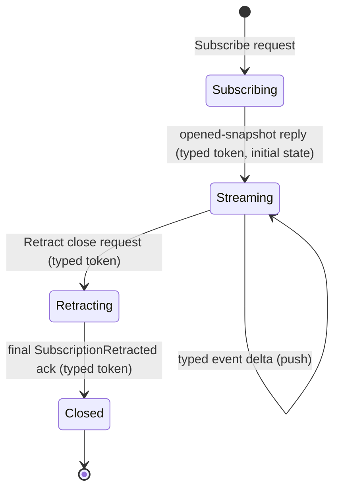
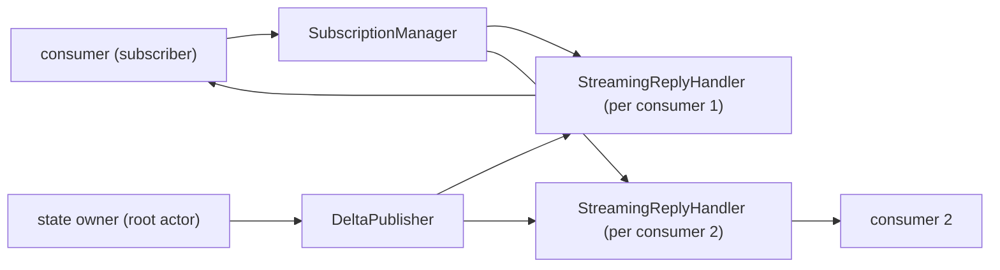

# Skill — subscription lifecycle

*The shape every push-stream subscription takes on a Signal channel:
typed open, typed event stream, typed close, final acknowledgement,
end. The producer pushes; the consumer subscribes; the close is a
real request, not a socket hang-up.*

---

## What this skill is for

Use this skill when you are designing or implementing a typed
push-subscription on a Signal channel — a long-lived flow where a
consumer registers once and the producer pushes typed events until
the consumer closes the stream.

The principle lives in `~/primary/ESSENCE.md` §"Polling is
forbidden". The mechanics for *how* a subscription opens, runs, and
closes live here. This skill is the canonical reference for any
contract crate that declares a `stream` block, and for any consumer
or producer that participates in one.

This skill is **not** about transport reachability probes,
backpressure-aware pacing, or `timerfd` deadlines — those are the
named carve-outs in `skills/push-not-pull.md` and they look
polling-shaped but are not subscriptions.

---

## The lifecycle FSM

Every typed subscription on a Signal channel passes through exactly
five named states.



State definitions:

- **Subscribing** — the consumer has sent the typed `Subscribe`
  request. No events have arrived yet.
- **Streaming** — the producer has replied with the typed
  opened-snapshot record (carrying the per-stream token and the
  initial state). Typed delta events arrive on the stream as the
  producer's state changes.
- **Retracting** — the consumer has sent the typed `Retract`
  close request, naming the per-stream token. No more deltas
  will arrive after this point; the producer may have one or
  more in-flight deltas that already left its buffer.
- **Closed** — the producer has emitted the typed
  `SubscriptionRetracted` acknowledgement carrying the same
  per-stream token. The stream is over; the underlying
  connection may be reused for the next exchange or dropped.

The transitions are typed records, never bare socket events. A TCP
or Unix socket reset *is not* a `Retract`; it is transport failure,
which the consumer may observe but is not part of the subscription
protocol.

---

## The kernel grammar enforces it

`signal-core`'s `signal_channel!` macro enforces this shape at
compile time. From `signal-core/macros/src/validate.rs`:303–331,
every declared stream block must:

- name an `opens` reply variant (the typed snapshot reply);
- name an `event` variant carrying the typed delta;
- name a `close` variant in the request block, and that close
  variant **must be tagged `Retract`**;
- have a `token` type that matches the close variant's payload
  type — the per-stream identity flows through the close request
  unchanged.

This is the kernel saying: *the consumer-initiated close is a
typed request, and the per-stream token is the identity that
binds open, deltas, and close together*. A contract that tries
to model close as a reply-side-only event will fail the macro's
cross-reference check.

The grammar shape:

```text
signal_channel! {
    channel Harness {
        request HarnessRequest {
            ...
            Subscribe SubscribeHarnessTranscript(SubscribeHarnessTranscript)
                opens HarnessTranscriptStream,
            Retract HarnessTranscriptRetraction(HarnessTranscriptToken),
        }
        reply HarnessEvent {
            ...
            HarnessTranscriptSnapshot(HarnessTranscriptSnapshot),
            HarnessSubscriptionRetracted(HarnessSubscriptionRetracted),
        }
        event HarnessStreamEvent {
            TranscriptObservation(TranscriptObservation) belongs HarnessTranscriptStream,
        }
        stream HarnessTranscriptStream {
            token HarnessTranscriptToken;
            opened HarnessTranscriptSnapshot;
            event TranscriptObservation;
            close HarnessTranscriptRetraction;
        }
    }
}
```

The five records (`SubscribeHarnessTranscript`,
`HarnessTranscriptSnapshot`, `TranscriptObservation`,
`HarnessTranscriptRetraction`, `HarnessSubscriptionRetracted`) and
the one token type (`HarnessTranscriptToken`) carry the entire
lifecycle. Nothing is encoded in the socket state.

---

## Constraints every subscription satisfies

A subscription's producer is the actor that owns the state being
observed. The producer commits to all of these:

1. **The open reply is a typed snapshot.** When the producer
   accepts a `Subscribe` request, the immediate reply carries the
   per-stream token plus a typed snapshot of the current state.
   No "subscribe then ask separately for current state" — that
   recreates the race the open-snapshot is designed to remove.
2. **Deltas push as typed events.** Every state change emits a
   typed event on the stream. The event carries enough context
   to be interpreted alone; there is no implicit "ask after each
   delta" round-trip.
3. **A sequence pointer (or equivalent) orders the events.** The
   consumer can detect gaps and re-anchor after reconnection.
   The pointer is part of the event payload, not implicit in
   socket order.
4. **Close is a typed `Retract` request.** The consumer sends a
   typed request carrying the per-stream token. The kernel
   grammar enforces this.
5. **The final acknowledgement is a typed `SubscriptionRetracted`
   reply.** The producer emits one final typed reply carrying the
   same token; the stream ends after this event. The consumer
   knows the close was honored.
6. **Back-pressure is demand-driven.** The consumer signals
   capacity; the producer never overruns. When the consumer's
   buffer is full, the producer waits, retries, or fails fast —
   it never silently drops events.
7. **Slow consumers cannot block siblings.** Each subscription
   has its own per-subscription state on the producer side. A
   slow consumer holds back its own stream, not the producer's
   ability to serve other consumers.
8. **Subscription state survives restart if the producer's state
   does.** Durable subscriptions persist their registration; on
   restart, the consumer resumes from the recorded sequence
   pointer. Transient subscriptions explicitly re-open after
   producer restart.

Each item above corresponds to a constraint test the producer's
ARCHITECTURE.md should name. Per `skills/architectural-truth-tests.md`,
the test proves the path was used, not only that the reply looked
acceptable.

---

## The producer's three-actor shape

A long-lived push subscription is *stateful behavior across time*.
Per `skills/actor-systems.md`, that means actors. A subscription
producer typically owns three named planes:



| Actor | Owns |
|---|---|
| `SubscriptionManager` | The set of open subscriptions: token → handler reference, registration metadata, ingress count, close discipline. Routes `Subscribe` and `Retract` requests to handlers. |
| `StreamingReplyHandler` | One per open subscription. Holds the connection, the per-stream token, the consumer's sequence cursor, the local outbound buffer, and the close ack flag. Receives `DeliverDelta` from the publisher; writes the event onto the wire. |
| `DeltaPublisher` | The fanout plane. Subscribes (in-process) to the root state actor's commit events; for each typed change, sends `DeliverDelta { event }` to every relevant `StreamingReplyHandler`. |

The publisher fans out by in-process actor mailbox sends, not by
shared lock or shared channel that consumers read from. Each
handler has its own mailbox; one slow handler stalls only its own
mailbox.

Scaled-down forms are acceptable when the design is small:

- **One subscription expected at a time:** collapse
  `SubscriptionManager` and `DeltaPublisher` into the root state
  actor; keep `StreamingReplyHandler` separate so slow consumers
  cannot block state changes.
- **No durable subscription state required:** skip the
  registration-record write; track only in-memory.

The three-actor split is the *full* shape the destination uses.
A prototype may scale down explicitly, with the ARCH naming the
scaled-down form and the constraint test naming what the
destination shape will check.

---

## Anti-patterns

**Reply-side-only retraction.** A contract that omits a
`Retract <name>` request variant and represents close only as a
reply event silently denies the consumer the right to close.
Either the consumer leaves the socket hanging (transport failure
as protocol) or it has no honest way to say "I am done." The
kernel grammar at `signal-core/macros/src/validate.rs:303–331`
rejects this shape.

**Socket close as semantic close.** Treating "the TCP/Unix socket
went away" as a `Retract` confuses transport failure with consumer
intent. A network partition is not consent. The typed close
request is the consent; the socket is the transport.

**Polling masquerading as subscription.** A "subscription" that
the consumer drives by re-asking on a timer is polling with a
nicer name. The producer pushes; the consumer reads from a long-
lived connection. If the consumer wakes on a clock to ask anything
about the producer's state, the producer's push side is incomplete.

**Shared lock for fanout.** A producer that holds an
`Arc<Mutex<Vec<Consumer>>>` and locks it to enqueue every delta
recreates the hidden-lock failure mode `skills/actor-systems.md`
warns against. Use per-consumer actor mailboxes for fanout; the
mailbox IS the per-consumer queue.

**No sequence pointer.** A stream without a per-event ordering
field cannot be re-anchored after a hiccup; the consumer cannot
prove it saw every event between two known points. Add a typed
sequence (newtype, not bare `u64`) to every event payload.

**Unbounded outbound buffer.** A `StreamingReplyHandler` whose
buffer can grow without limit translates a slow consumer into a
producer-side OOM. Bound the buffer; on overrun, the contract
defines the failure (drop the slow subscription with a typed
failure reply, or refuse to accept more events from the
publisher until the handler drains).

---

## When the open snapshot is empty

The open snapshot reply is never optional, but it may be empty.
A subscription opened against a fresh harness gets a snapshot
that says "current sequence = 0, current state = empty"; a
subscription opened against a long-running harness gets a snapshot
naming the current sequence and the current state.

The consumer always knows where it starts. There is no "I subscribed
but I don't know if I missed events" state.

---

## Reconnection and resume

When a subscription drops mid-stream (transport failure, producer
restart, consumer restart), the consumer reconnects by opening a
new subscription. The producer's `Subscribe` request can carry a
typed `resume_after` field (an optional sequence pointer); the
producer either:

- replays events from `resume_after + 1` if it has them in
  durable storage, then continues with live deltas;
- replies with `ResumeUnavailable` (a typed reply variant), and
  the consumer accepts the gap and restarts from snapshot.

Both choices are explicit, typed, and observable. The consumer is
never left guessing whether it has a complete view.

For prototypes that do not yet persist subscription state, the
typed resume request still exists in the contract; the producer
just always replies `ResumeUnavailable`. The destination shape is
present; the runtime is scaffolded.

---

## Witness shape

Every subscription producer's ARCHITECTURE.md names these tests:

| Constraint | Witness |
|---|---|
| Open returns typed snapshot with current sequence and state. | A subscriber connects to a fresh producer; assertion: the open reply is a typed snapshot record with the expected token. |
| One delta per state change, ordered by sequence. | Producer changes state N times; subscriber receives N events with sequence 1..N. |
| Close is a typed Retract request; final ack is typed. | Subscriber sends typed close request; final reply is the typed `SubscriptionRetracted` record carrying the same token. Stream ends after that frame. |
| Slow consumer does not block siblings. | Two subscribers; one stalls reads; producer keeps emitting deltas to the other subscriber within bounded latency. |
| Back-pressure is demand-driven. | When subscriber's buffer is full, the producer waits or fails fast per the typed contract; the producer never overruns. |
| Sequence pointer is monotonic. | A test reads N consecutive events and asserts the sequence field is strictly increasing. |

The tests use real actor mailboxes and real connections (Unix
sockets, in-process channels). Mocked subscription delivery is
forbidden — a mock cannot witness that the producer holds a real
per-subscription handler.

---

## See also

- `~/primary/ESSENCE.md` §"Polling is forbidden" — the upstream
  principle this skill implements.
- this workspace's `skills/push-not-pull.md` — when polling
  shows up, how to recognise it, how to escalate when the
  producer cannot yet push.
- this workspace's `skills/actor-systems.md` — actor-density
  rules; subscription producers are actor-shaped because they
  are stateful across time.
- this workspace's `skills/kameo.md` — runtime details for the
  three-actor shape in Rust.
- this workspace's `skills/contract-repo.md` — contract-crate
  conventions for declaring stream blocks.
- this workspace's `skills/architectural-truth-tests.md` —
  witness discipline for the constraints above.
- `signal-core/macros/src/validate.rs` lines 303–331 — kernel
  grammar that enforces the close-is-Retract rule.
